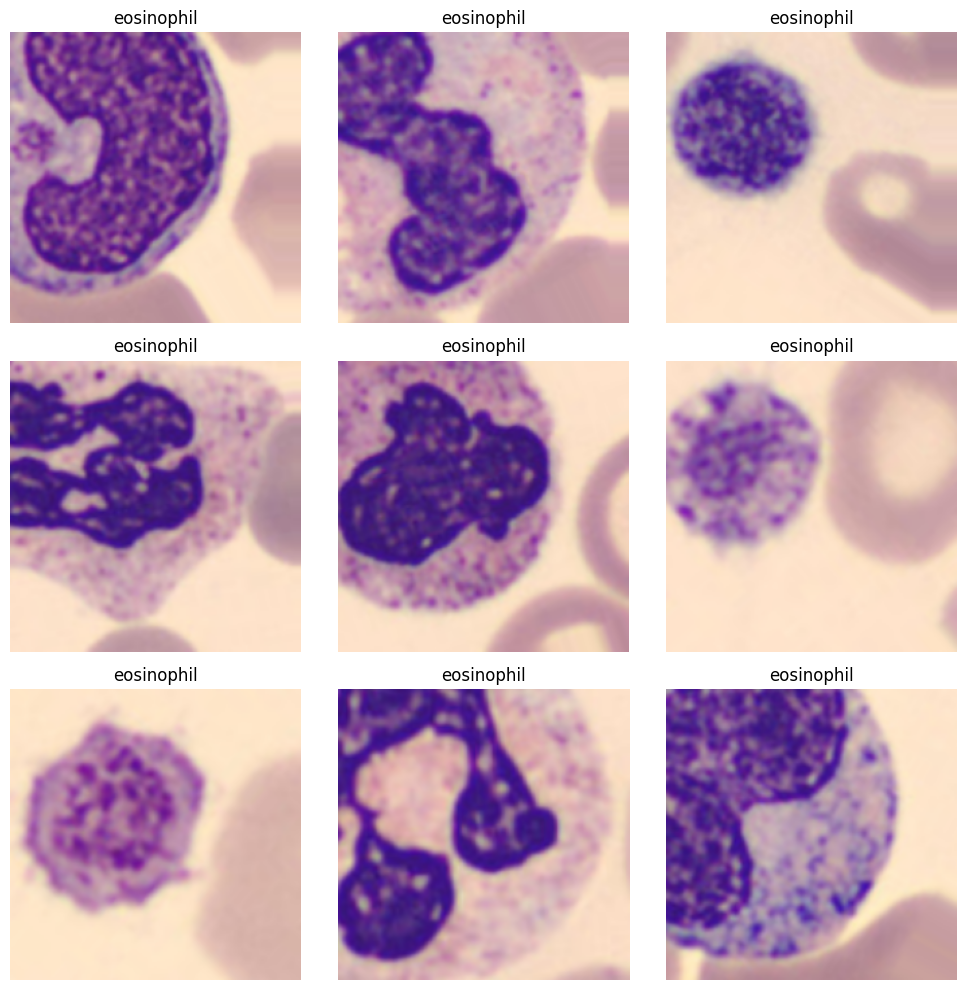
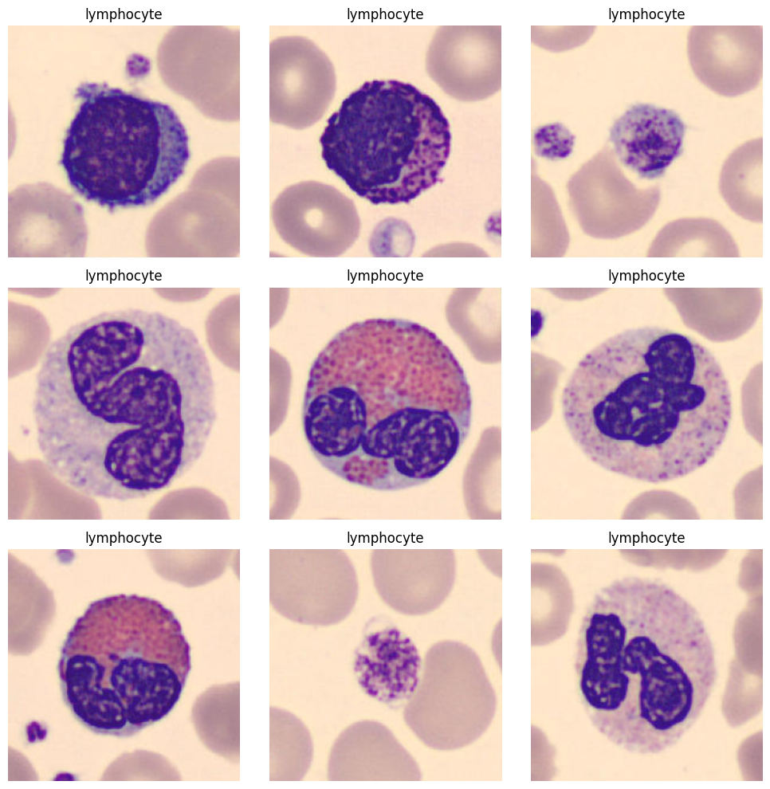
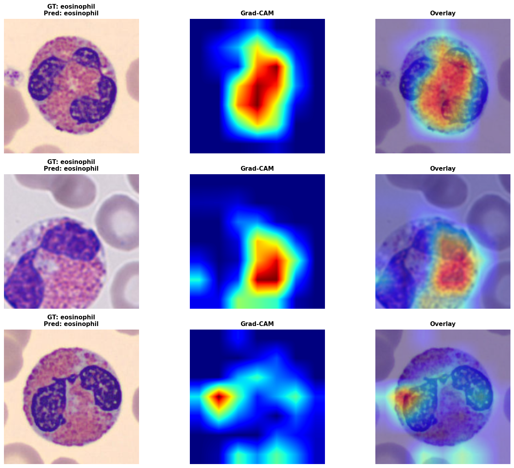
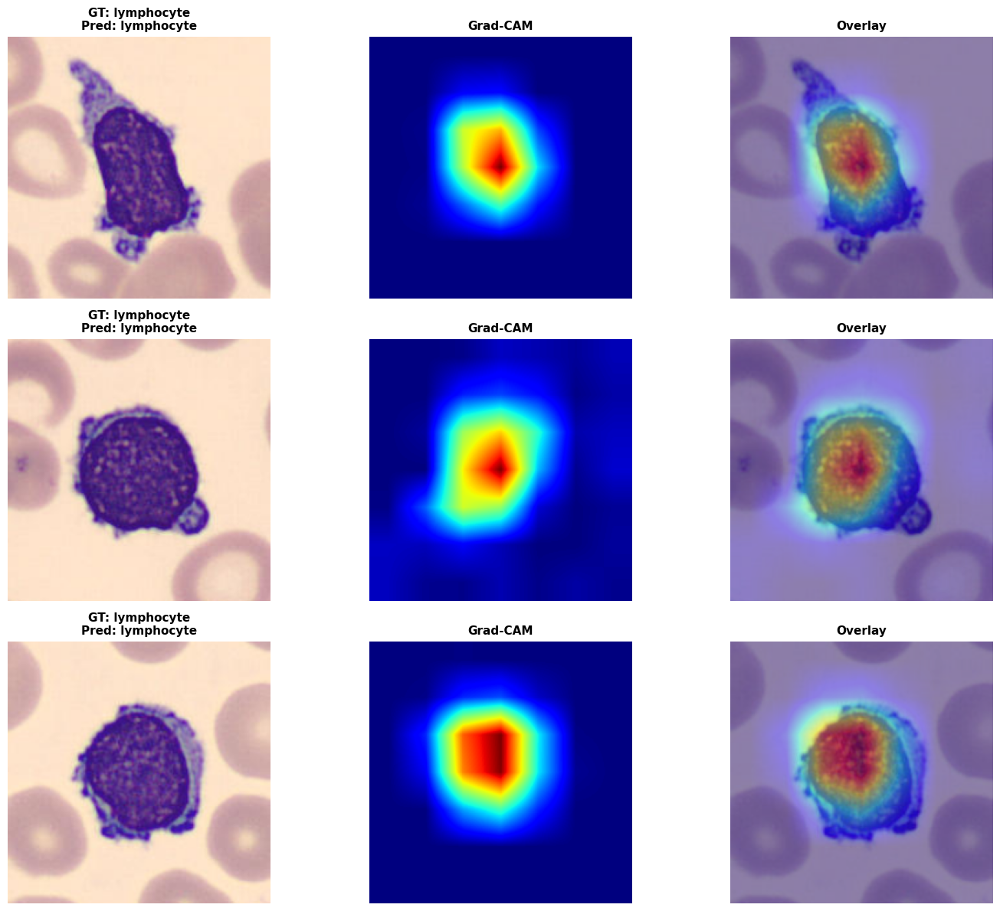

# Blood Cell Multiclass Classification

This tutorial covers:

- Loading the Blood Cell Microscope dataset from **MedMNIST**, an ``8``-class ``2D`` classification dataset.
- Building a data loader using the ``tf.data`` API.
- Building a multiclass classification model.
- Training the model using the Keras training API.
- Computing **GradCAM** visualizations.


[MedMNIST](https://medmnist.com/) is a large-scale, MNIST-like collection of standardized biomedical images, including ``12`` datasets for 2D and ``6`` datasets for 3D. The datasets are available at sizes of ``64x64``, ``128x128``, and ``224x224`` for 2D, and ``64x64x64`` for 3D.

```{note}
This code example uses the ``tf.data`` API to build the data loader, so the
``tensorflow`` backend is required. To use another backend, use
``torch.utils.data`` with the ``torch`` backend or use a **PyGrain** data loader,
which works with all backends.

This example uses Tesla T4 GPUs available in the Kaggle environment. You can also run it directly on Kaggle using this [GPU notebook](https://www.kaggle.com/code/ipythonx/medicai-x-medmnist-x-multi-class-x-gradcam).

```

## Setup

```bash
pip install git+https://github.com/innat/MedMNIST.git -q
pip install git+https://github.com/innat/medic-ai.git -q
```

## Imports

```python
import os
os.environ["KERAS_BACKEND"] = "tensorflow"

import keras
import medmnist
from medmnist import INFO
import tensorflow as tf

from medicai.utils import GradCAM
from medicai.models import EfficientNetV2B1
from medicai.transforms import (
    Compose,
    RandomFlip,
    RandomRotate,
    RandomElasticTransform,
    ScaleIntensityRange,
)

import textwrap
import numpy as np 
import pandas as pd
from matplotlib import pyplot as plt

print(
    f"keras backend: {keras.config.backend()}\n"
    f"keras version: {keras.version()}\n"
)
```
```python
# reproducibility
keras.utils.set_random_seed(101)

# Enable mixed precision.
keras.mixed_precision.set_global_policy("mixed_float16")
```

## Data Acquisition

We use the ``bloodmnist`` subset from MedMNIST, which is packaged as a NumPy archive containing predefined training, validation, and test splits. In this step, we download the dataset metadata, resolve the dataset class dynamically from MedMNIST's registry, and store the data locally at the requested image resolution.

```python
input_size = 224
data_flag = 'bloodmnist'

info = INFO[data_flag]
task = info['task']
label_map = info['label']

download = True
DataClass = getattr(medmnist, info['python_class'])

output_root = os.path.join("./", data_flag)
os.makedirs(output_root, exist_ok=True)

_ = DataClass(
    split="train", 
    root=output_root, 
    size=input_size, 
    download=True
)

# print(os.listdir(output_root))
# print(info['description'])
# print(info['n_samples'])
# print(info['license'])
# print(label_map)
```

```python
npz_file = np.load(
    os.path.join(
        output_root, "{}_{}.npz".format(data_flag,input_size)
    )
)
x_train = npz_file['train_images']
y_train = npz_file['train_labels']
x_val = npz_file['val_images']
y_val = npz_file['val_labels']
x_test = npz_file['test_images']
y_test = npz_file['test_labels']

print('Train set ', x_train.shape, y_train.shape)
print('Val set ', x_val.shape, y_val.shape)
print('Test set ', x_test.shape, y_test.shape)
```

## Transformation

```python
train_augmenter = Compose(
    [
        ScaleIntensityRange(
            keys=["image"],
            source_value_range=(0.0, 255.0),
            target_value_range=(0.0, 1.0),
            clip=True,
            input_layout="BHWC",
        ),
        RandomFlip(
            keys=["image"],
            spatial_axis=1,
            prob=0.6,
            input_layout="BHWC",
        ),
        RandomFlip(
            keys=["image"],
            spatial_axis=2,
            prob=0.6,
            input_layout="BHWC",
        ),
        RandomRotate(
            keys=["image"],
            factor=0.3,
            interpolation="bilinear",
            fill_mode="nearest",
            prob=0.7,
            input_layout="BHWC",
        ),
        RandomElasticTransform(
            keys=["image"],
            input_layout="BHWC",
            alpha=(2.0, 5.0),
            sigma=(4.0, 8.0),
            control_grid_spacing=(16, 16),
            field_interpolation="bspline",
            prob=0.8,
        )
    ]
)

val_augmenter = Compose(
    [
        ScaleIntensityRange(
            keys=["image"],
            source_value_range=(0.0, 255.0),
            target_value_range=(0.0, 1.0),
            clip=True,
            input_layout="BHWC",
        ),
    ]
)
```
```python
def train_transformation(image, label):
    result = train_augmenter(
        {
            "image": image
        }
    )
    return result["image"], label

def val_transformation(image, label):
    result = val_augmenter(
        {
            "image": image
        }
    )
    return result["image"], label
```

## Data Loader

Before training, we convert the raw NumPy arrays into efficient ``tf.data`` pipelines. We apply lightweight image augmentation only to the training split, keep validation and test preprocessing deterministic, and use batching and prefetching to improve GPU utilization.


```python
def get_tf_dataset(x, y, batch_size=32, shuffle=True, augment=False):
    ds = tf.data.Dataset.from_tensor_slices((x, y))

    if shuffle:
        ds = ds.shuffle(buffer_size=min(1000, len(x)))

    ds = ds.batch(batch_size, drop_remainder=augment)

    if augment:
        ds = ds.map(
            train_transformation, num_parallel_calls=tf.data.AUTOTUNE
        )
    else:
        ds = ds.map(
            val_transformation, num_parallel_calls=tf.data.AUTOTUNE
        )

    ds = ds.prefetch(tf.data.AUTOTUNE)
    return ds
```

This helper wraps the NumPy arrays in a reusable ``tf.data`` input pipeline. During augmented training, ``drop_remainder=True`` keeps batch shapes consistent, while the validation and test loaders retain all remaining samples for evaluation.

```python
train_ds = get_tf_dataset(
    x_train, y_train, shuffle=True, augment=True
)

val_ds = get_tf_dataset(
    x_val, y_val, shuffle=False
)

test_ds = get_tf_dataset(
    x_test, y_test, shuffle=False
)
```

To sanity-check the pipeline, the next helper draws a few samples from a dataset batch. The class labels are used only for the plot title lookup; they do not filter the dataset to a specific class.

```python
def plot_dataset_samples(dataset, n=9):
    plt.figure(figsize=(10, 10))

    cols = int(np.ceil(np.sqrt(n)))
    rows = int(np.ceil(n / cols))

    for i, (images, labels) in enumerate(dataset.unbatch().take(n)):
        ax = plt.subplot(rows, cols, i + 1)

        img = images.numpy()
        lbl = np.squeeze(labels.numpy())

        # Keep images in the normalized [0, 1] range for plotting.
        img = np.clip(img, 0.0, 1.0)

        # Convert (H, W, 1) grayscale images to (H, W).
        if img.ndim == 3 and img.shape[-1] == 1:
            img = img[..., 0]

        if img.ndim == 2:
            ax.imshow(img, cmap="gray", vmin=0.0, vmax=1.0)
        else:
            ax.imshow(img, vmin=0.0, vmax=1.0)
        class_name = label_map[str(int(lbl))]
        ax.set_title("\n".join(textwrap.wrap(class_name, width=12)))
        ax.axis("off")

    plt.tight_layout()
    plt.show()
```

```python
plot_dataset_samples(train_ds, n=6)
```




```python
plot_dataset_samples(val_ds,  n=6)
```



## Model

For this task, we use ``EfficientNetV2B1`` as a multiclass image classifier with a ``softmax`` prediction head. After creating the network, we configure the optimizer, classification loss, and accuracy metric using the standard Keras training workflow.

```python
model = EfficientNetV2B1(
    input_shape=(
        input_size, input_size, 3
    ),
    include_top=True,
    classifier_activation='softmax',
    num_classes=len(label_map),
)
# model.summary(line_length=100)
model.count_params() / 1e6
```

```python
# Define the optimizer, loss, and metrics.
optim = keras.optimizers.AdamW(
    learning_rate=1e-4,
    weight_decay=1e-5,
)
loss_fn = keras.losses.SparseCategoricalCrossentropy(
    from_logits=False, name='loss'
)
metrics = [
    keras.metrics.SparseCategoricalAccuracy(name='acc'),
]

# Compile the Keras model with the defined optimizer, loss, and metrics.
model.compile(
    optimizer=optim,
    loss=loss_fn,
    metrics=metrics
)
```

Because the MedMNIST labels are stored as integer class indices rather than one-hot vectors, ``SparseCategoricalCrossentropy`` is the appropriate loss for this setup.

## Training

The model is trained on the augmented training dataset while monitoring validation performance after each epoch. We also save the best weights using a checkpoint callback so that later evaluation uses the strongest validation checkpoint instead of the final epoch by default.

```python
model_ckpt_callback = keras.callbacks.ModelCheckpoint(
    filepath='bloodmnist.weights.h5',
    save_freq='epoch',
    verbose=0, 
    monitor='val_loss', 
    save_weights_only=True, 
    save_best_only=True
)   


model.fit(
    train_ds,
    validation_data=val_ds,
    callbacks=[model_ckpt_callback],
    epochs=50
)
```

## Evaluation

Once training is complete, we reload the best saved weights and measure performance on the held-out test split. This gives us a cleaner estimate of how well the classifier generalizes to unseen blood cell images.

```python
model.load_weights('bloodmnist.weights.h5')
results = model.evaluate(test_ds)
print("test loss, test acc:", results)
```

## Visualization

To make the predictions easier to interpret, we generate ``GradCAM`` heatmaps on test images. These visualizations highlight the image regions that most strongly influenced the model's decision for a selected target class, which is especially useful for sanity-checking model attention in medical imaging workflows.

- Pick a target layer. Inspect `model.layers` to find its name.
- Pick a target class index. Inspect `label_map` to select the target class.

The visualization helper below shuffles one batch from the test dataset, filters it to the requested target class, and then generates ``GradCAM`` heatmaps for a few matching samples. Because it operates on a single shuffled batch, it is normal to occasionally see no matches for a rare class in that batch.

```python
def plot_gradcam_results(
    model,
    grad_cam,
    test_ds,
    label_map,
    target_index=0,
    n=3,
):
    # Temporarily shuffle the dataset to vary the visualized samples.
    ds_vis = test_ds.shuffle(buffer_size=2048)
    test_x, test_y = next(iter(ds_vis))

    test_y = test_y.numpy().squeeze()
    test_x = test_x.numpy()

    # Select only samples with the target class.
    mask = test_y == target_index
    test_x = test_x[mask]
    test_y = test_y[mask]

    if len(test_x) == 0:
        print(
            f"No samples with target_index={target_index} in this batch."
        )
        return

    # Limit the number of samples to visualize.
    n = min(n, len(test_x))

    # Generate model predictions.
    preds = model.predict(test_x[:n], verbose=0)
    pred_classes = preds.argmax(-1)

    # Compute Grad-CAM heatmaps.
    heatmaps = grad_cam.compute_heatmap(
        test_x[:n],
        target_class_index=target_index,
    )

    # Create the figure.
    fig, axes = plt.subplots(
        n,
        3,
        figsize=(15, 4 * n),
        squeeze=False,
    )

    for i in range(n):
        img = test_x[i]
        heat = heatmaps[i]

        gt_label = label_map.get(
            str(int(test_y[i])),
            str(int(test_y[i])),
        )

        pred_label = label_map.get(
            str(int(pred_classes[i])),
            str(int(pred_classes[i])),
        )

        # Normalize image for visualization
        if img.max() <= 1:
            img_vis = np.clip(img, 0, 1)
        else:
            img_vis = img.astype(np.uint8)

        # Original image
        ax1 = axes[i, 0]
        ax1.imshow(img_vis)
        ax1.set_title(
            f"GT: {gt_label}\nPred: {pred_label}",
            fontsize=11,
            weight="bold",
        )
        ax1.axis("off")

        # Grad-CAM heatmap
        ax2 = axes[i, 1]
        ax2.imshow(heat, cmap="jet")
        ax2.set_title(
            "Grad-CAM",
            fontsize=11,
            weight="bold",
        )
        ax2.axis("off")

        # Overlay
        ax3 = axes[i, 2]
        ax3.imshow(img_vis)
        ax3.imshow(heat, cmap="jet", alpha=0.45)
        ax3.set_title(
            "Overlay",
            fontsize=11,
            weight="bold",
        )
        ax3.axis("off")

    plt.tight_layout()
    plt.show()
```

We can inspect the target layer from the model.

```python
# for layer in model.layers[::-1]:
#     print(layer.name, layer.output.shape)
```

**Instantiate the ``GradCAM``**: Here we use ``top_activation`` as the target layer because it is a strong high-level feature map near the classifier head for this architecture. If you switch to a different backbone, inspect ``model.layers`` again and choose a semantically similar late convolutional or activation layer.

```python
grad_cam = GradCAM(
    model,
    target_layer='top_activation',
    task_type='auto'
)
```
```python
label_map
```
```bash
{
    '0': 'basophil',
    '1': 'eosinophil',
    '2': 'erythroblast',
    '3': 'immature granulocytes(myelocytes, metamyelocytes and promyelocytes)',
    '4': 'lymphocyte',
    '5': 'monocyte',
    '6': 'neutrophil',
    '7': 'platelet
 }
```
```python
plot_gradcam_results(
    model, grad_cam, test_ds, label_map, target_index=1, n=3
)
```


```python
plot_gradcam_results(
    model, grad_cam, test_ds, label_map, target_index=4, n=3
)
```

