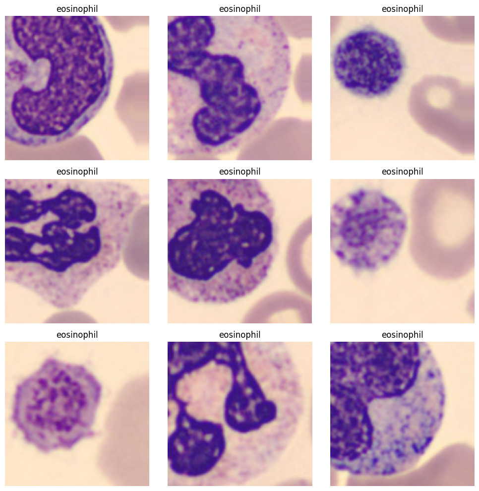
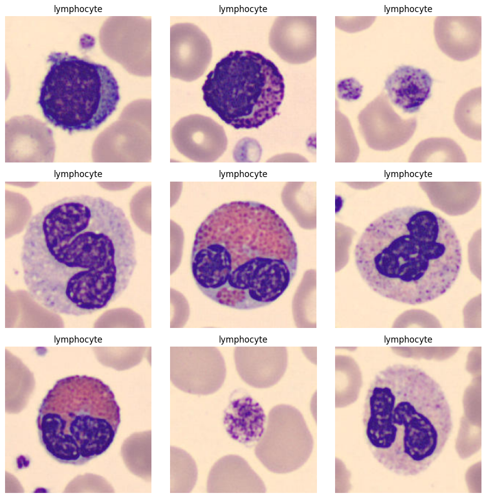
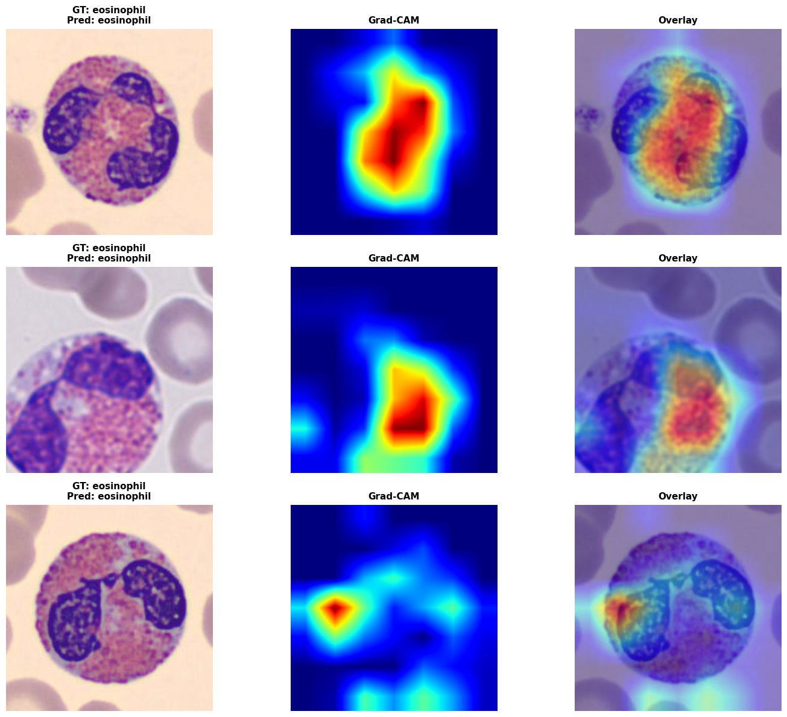
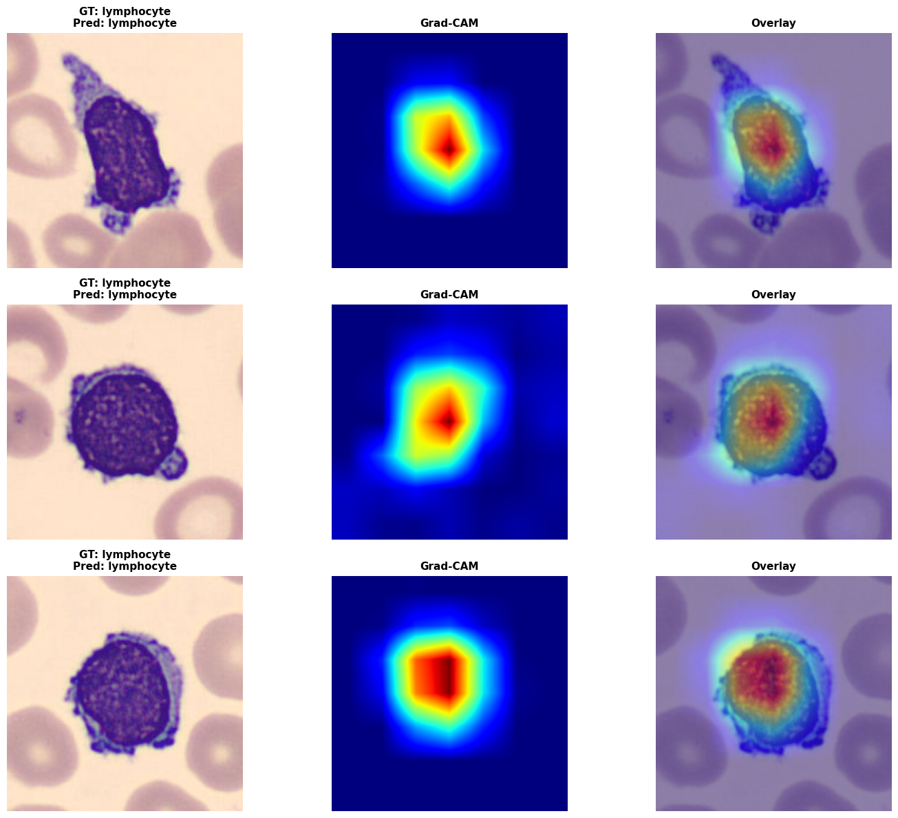

# Blood Cell Multiclass Classification

In this tutorial, we are going to cover:

- Load the Blood Cell Microscope dataset from **MedMNIST**, an ``8`` class ``2D`` classification dataset.
- Build a data loader using the ``tf.data`` API.
- Build a multiclass classification model.
- Train the model using the Keras training API.
- Compute **GradCAM** visualizations.


[MedMNIST](https://medmnist.com/), a large-scale MNIST-like collection of standardized biomedical images, including ``12`` datasets for 2D and ``6`` datasets for 3D. It has larger sizes: ``64x64``, ``128x128``, and ``224x224`` for 2D, and ``64x64x64`` for 3D.

## Setup 

```bash
pip install git+https://github.com/innat/MedMNIST.git -q
pip install git+https://github.com/innat/medic-ai.git -q
```

## Imports

```python
import os
os.environ["KERAS_BACKEND"] = "tensorflow" # tensorflow, torch, jax
os.environ['TF_CPP_MIN_LOG_LEVEL'] = '3'

import tensorflow as tf
import keras

import medmnist
from medmnist import INFO

from medicai.utils import GradCAM
from medicai.models import EfficientNetV2B0

import numpy as np 
import pandas as pd
from matplotlib import pyplot as plt

# reproducibility
keras.utils.set_random_seed(101)
```

## Data Acquisition

We use the ``bloodmnist`` subset from MedMNIST, which is packaged as a NumPy archive containing predefined training, validation, and test splits. In this step, we download the dataset metadata, resolve the dataset class dynamically from MedMNIST's registry, and store the data locally at the requested image resolution.

```python
input_size = 224
data_flag = 'bloodmnist'

info = INFO[data_flag]
task = info['task']
label_map = info['label']

download = True
DataClass = getattr(medmnist, info['python_class'])

output_root = os.path.join("./", data_flag)
os.makedirs(output_root, exist_ok=True)

_ = DataClass(
    split="train", 
    root=output_root, 
    size=input_size, 
    download=True
)

# print(os.listdir(output_root))
# print(info['description'])
# print(info['n_samples'])
# print(info['license'])
# print(label_map)
```

```python
npz_file = np.load(
    os.path.join(
        output_root, "{}_{}.npz".format(data_flag,input_size)
    )
)
x_train = npz_file['train_images']
y_train = npz_file['train_labels']
x_val = npz_file['val_images']
y_val = npz_file['val_labels']
x_test = npz_file['test_images']
y_test = npz_file['test_labels']

print('Train set ', x_train.shape, y_train.shape)
print('Val set ', x_val.shape, y_val.shape)
print('Test set ', x_test.shape, y_test.shape)
```

## Data Loader

Before training, we convert the raw NumPy arrays into performant ``tf.data`` pipelines. We apply lightweight image augmentation to the training split only, keep validation and test preprocessing deterministic, and use batching plus prefetching to make GPU training smoother.

The augmentation pipeline below applies simple geometric perturbations to improve robustness. Because ``RandomCrop`` changes the spatial size, we resize the image back to ``input_size`` before feeding it to the classifier. We also cast labels into a tensor format that works cleanly with Keras sparse classification losses.

```python
# Define augmentation layers
aug_layers = [
    keras.layers.RandomFlip("horizontal_and_vertical"),
    keras.layers.RandomRotation(0.2, fill_mode="nearest"),
    keras.layers.RandomZoom(0.2, fill_mode="nearest"),
    keras.layers.RandomCrop(
        int(input_size // 1.5),
        int(input_size // 1.5)
    ),
]

def augment_data(x, y):
    for layer in aug_layers:
        x = layer(x)
    x = keras.layers.Resizing(
        input_size, input_size, interpolation="bilinear"
    )(x)
    y = tf.cast(
        tf.cast(y, tf.int32), tf.float32
    )
    return x, y
```

```python
def get_tf_dataset(x, y, batch_size=32, shuffle=True, augment=False):
    ds = tf.data.Dataset.from_tensor_slices((x, y))

    if shuffle:
        ds = ds.shuffle(buffer_size=min(1000, len(x)))

    ds = ds.batch(batch_size, drop_remainder=augment)

    if augment:
        ds = ds.map(
            augment_data, num_parallel_calls=tf.data.AUTOTUNE
        )

    ds = ds.prefetch(tf.data.AUTOTUNE)
    return ds
```

This helper wraps the NumPy arrays into a reusable ``tf.data`` input pipeline. During augmented training, ``drop_remainder=True`` keeps batch shapes consistent, while validation and test loaders keep all remaining samples for evaluation.

```python
train_ds = get_tf_dataset(
    x_train, y_train, shuffle=True, augment=True
)

val_ds = get_tf_dataset(
    x_val, y_val, shuffle=False
)

test_ds = get_tf_dataset(
    x_test, y_test, shuffle=False
)
```

To sanity-check the pipeline, the next helper draws a few samples from a dataset batch. Note that ``class_ids`` is used only for the plot title lookup here; it does not filter the dataset to that specific class.

```python
def plot_dataset_samples(dataset, class_ids=None, n=9):
    plt.figure(figsize=(10, 10))
    
    for i, (images, labels) in enumerate(dataset.unbatch().take(n)):
        ax = plt.subplot(int(n ** 0.5 + 0.5), int(n ** 0.5 + 0.5), i + 1)
        img = images.numpy()
        lbl = labels.numpy()

        # handle grayscale or float images
        if img.ndim == 2:
            plt.imshow(img, cmap='gray')
        else:
            plt.imshow(img.astype("uint8"))

        plt.title(label_map[str(class_ids)])
        plt.axis("off")
    plt.tight_layout()
    plt.show()

# print(label_map)
```

```python
plot_dataset_samples(train_ds, class_ids=1, n=3)
```




```python
plot_dataset_samples(val_ds, class_ids=4, n=3)
```



## Model

For this task, we use ``EfficientNetV2B0`` as a multiclass image classifier with a ``softmax`` prediction head. After creating the network, we configure the optimizer, classification loss, and accuracy metric using the standard Keras training workflow.

```python
model = EfficientNetV2B0(
    input_shape=(
        input_size, input_size, 3
    ),
    include_top=True,
    classifier_activation='softmax',
    num_classes=len(label_map),
)
# model.summary(line_length=100)
model.count_params() / 1e6
```

```python
# define optomizer, loss, metrics
optim = keras.optimizers.AdamW(
    learning_rate=1e-4,
    weight_decay=1e-5,
)
loss_fn = keras.losses.SparseCategoricalCrossentropy(
    from_logits=False, name='loss'
)
metrics = [
    keras.metrics.SparseCategoricalAccuracy(name='acc'),
]

# compile keras model with defined optimozer, loss and metrics
model.compile(
    optimizer=optim,
    loss=loss_fn,
    metrics=metrics
)
```

Because the MedMNIST labels are stored as integer class indices rather than one-hot vectors, ``SparseCategoricalCrossentropy`` is the appropriate loss for this setup.

## Training

The model is trained on the augmented training dataset while monitoring validation performance after each epoch. We also save the best weights using a checkpoint callback so that later evaluation uses the strongest validation checkpoint instead of the final epoch by default.

```python
model_ckpt_callback = keras.callbacks.ModelCheckpoint(
    filepath='model.weights.h5', 
    save_freq='epoch', 
    verbose=0, 
    monitor='val_loss', 
    save_weights_only=True, 
    save_best_only=True
)   


model.fit(
    train_ds,
    validation_data=val_ds,
    callbacks=[model_ckpt_callback],
    epochs=50
)
```

## Evaluation

Once training is complete, we reload the best saved weights and measure performance on the held-out test split. This gives us a cleaner estimate of how well the classifier generalizes to unseen blood cell images.

```python
model.load_weights('model.weights.h5')
results = model.evaluate(test_ds)
print("test loss, test acc:", results)
```

## Visualization

To make the predictions easier to interpret, we generate ``GradCAM`` heatmaps on test images. These visualizations highlight the image regions that most strongly influenced the model's decision for a selected target class, which is especially useful for sanity-checking model attention in medical imaging workflows.

- Pick target layers. Inspect `model.layers` to get target layer's name.
- Pick target class index. Inspect `label_map` to select target class.

The visualization helper below shuffles one batch from the test dataset, filters it to the requested target class, and then generates ``GradCAM`` heatmaps for a few matching samples. Because it operates on a single shuffled batch, it is normal to occasionally see no matches for a rare class in that batch.

```python
def plot_gradcam_results(
    model,
    grad_cam,
    test_ds,
    label_map,
    target_index=0,
    n=3,
):
    # Temporarily shuffle dataset to get variation in output
    ds_vis = test_ds.shuffle(buffer_size=2048)
    test_x, test_y = next(iter(ds_vis))

    test_y = test_y.numpy().squeeze()
    test_x = test_x.numpy()

    # Select only samples with the target class
    mask = test_y == target_index
    test_x = test_x[mask]
    test_y = test_y[mask]

    if len(test_x) == 0:
        print(
            f"No samples with target_index={target_index} in this batch."
        )
        return

    # Number of samples to visualize
    n = min(n, len(test_x))

    # Model predictions
    preds = model.predict(test_x[:n], verbose=0)
    pred_classes = preds.argmax(-1)

    # Compute Grad-CAM heatmaps
    heatmaps = grad_cam.compute_heatmap(
        test_x[:n],
        target_class_index=target_index,
    )

    # Create figure
    fig, axes = plt.subplots(
        n,
        3,
        figsize=(15, 4 * n),
        squeeze=False,
    )

    for i in range(n):
        img = test_x[i]
        heat = heatmaps[i]

        gt_label = label_map.get(
            str(int(test_y[i])),
            str(int(test_y[i])),
        )

        pred_label = label_map.get(
            str(int(pred_classes[i])),
            str(int(pred_classes[i])),
        )

        # Normalize image for visualization
        if img.max() <= 1:
            img_vis = np.clip(img, 0, 1)
        else:
            img_vis = img.astype(np.uint8)

        # Original image
        ax1 = axes[i, 0]
        ax1.imshow(img_vis)
        ax1.set_title(
            f"GT: {gt_label}\nPred: {pred_label}",
            fontsize=11,
            weight="bold",
        )
        ax1.axis("off")

        # Grad-CAM heatmap
        ax2 = axes[i, 1]
        ax2.imshow(heat, cmap="jet")
        ax2.set_title(
            "Grad-CAM",
            fontsize=11,
            weight="bold",
        )
        ax2.axis("off")

        # Overlay
        ax3 = axes[i, 2]
        ax3.imshow(img_vis)
        ax3.imshow(heat, cmap="jet", alpha=0.45)
        ax3.set_title(
            "Overlay",
            fontsize=11,
            weight="bold",
        )
        ax3.axis("off")

    plt.tight_layout()
    plt.show()
```

We can inspect the target layer from the model.

```python
# for layer in model.layers[::-1]:
#     print(layer.name, layer.output.shape)
```

**Instantiate the ``GradCAM``**: Here we use ``top_activation`` as the target layer because it is a strong high-level feature map near the classifier head for this architecture. If you switch to a different backbone, inspect ``model.layers`` again and choose a semantically similar late convolutional or activation layer.

```python
grad_cam = GradCAM(
    model,
    target_layer='top_activation',
    task_type='auto'
)
```
```python
label_map
```
```bash
{
    '0': 'basophil',
    '1': 'eosinophil',
    '2': 'erythroblast',
    '3': 'immature granulocytes(myelocytes, metamyelocytes and promyelocytes)',
    '4': 'lymphocyte',
    '5': 'monocyte',
    '6': 'neutrophil',
    '7': 'platelet
 }
```
```python
plot_gradcam_results(
    model, grad_cam, test_ds, label_map, target_index=1, n=3
)
```


```python
plot_gradcam_results(
    model, grad_cam, test_ds, label_map, target_index=4, n=3
)
```

