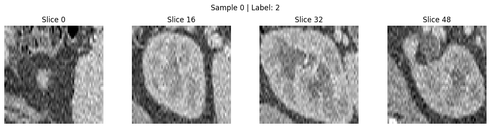
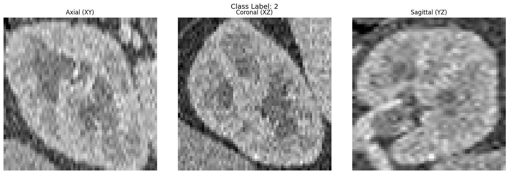
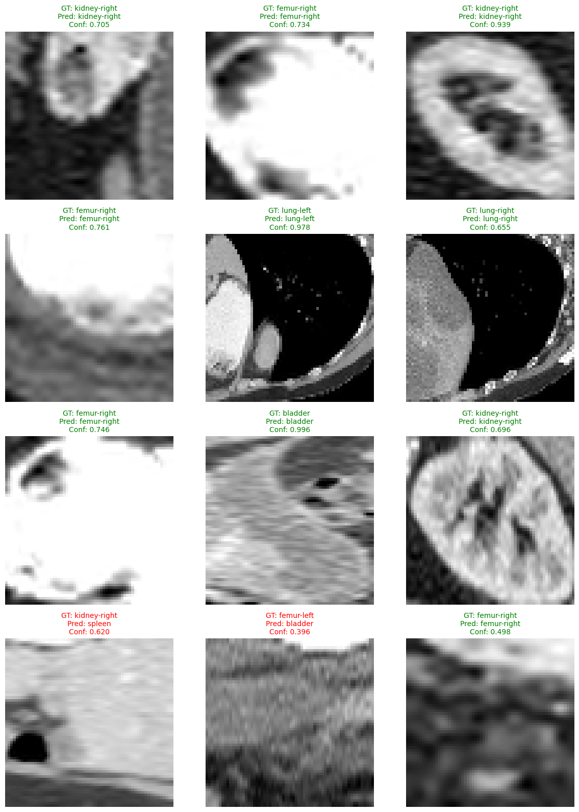

# Organ Classification from 3D CT Volumes

In this tutorial, we are going to cover:

- Load the **OrganMNIST3D** subset from **MedMNIST**, an ``11`` class ``3D`` classification dataset.
- Build volumetric data pipelines with ``medicai.transforms`` and ``tf.data``.
- Train a ``3D`` classification model using the Keras training API.
- Evaluate the model on the held-out test split.
- Visualize representative slices from volumetric samples.

[MedMNIST](https://medmnist.com/) is a standardized biomedical benchmark
collection that includes both ``2D`` and ``3D`` datasets. In this example, we
work with ``organmnist3d``, where each sample is a ``64 x 64 x 64`` grayscale
volume and the target is one of ``11`` anatomical classes.

## Setup

```bash
pip install git+https://github.com/innat/MedMNIST.git -q
pip install git+https://github.com/innat/medic-ai.git -q
```

## Imports

```python
import os
os.environ["KERAS_BACKEND"] = "tensorflow" # tensorflow, torch, jax
os.environ['TF_CPP_MIN_LOG_LEVEL'] = '3'

import tensorflow as tf
import keras

import medmnist
from medmnist import INFO

from medicai.utils import GradCAM
from medicai.models import ResNet50
from medicai.transforms import (
    Compose,
    ScaleIntensityRange,
    RandomShiftIntensity,
    RandomRotate90,
    RandomFlip,
    LambdaTransform
)

import numpy as np 
import pandas as pd
from matplotlib import pyplot as plt

# reproducibility
keras.utils.set_random_seed(101)
```

## Data Acquisition

We use the ``organmnist3d`` subset from MedMNIST, which is distributed as a
NumPy archive with predefined training, validation, and test splits. In this
step, we download the dataset metadata, resolve the MedMNIST dataset class, and
inspect the anatomical label mapping used by the benchmark.

```python
input_size = 64
data_flag = 'organmnist3d'

info = INFO[data_flag]
task = info['task']
label_map = info['label']

download = True
DataClass = getattr(medmnist, info['python_class'])

output_root = os.path.join("./", data_flag)
os.makedirs(output_root, exist_ok=True)

_ = DataClass(split="train", root=output_root, size=input_size, download=True)

# print(os.listdir(output_root))
# print(info['description'])
# print(info['n_samples'])
# print(info['license'])
# print(label_map)
```

```python
label_map
```
```
{
    '0': 'liver',
    '1': 'kidney-right',
    '2': 'kidney-left',
    '3': 'femur-right',
    '4': 'femur-left',
    '5': 'bladder',
    '6': 'heart',
    '7': 'lung-right',
    '8': 'lung-left',
    '9': 'spleen',
    '10': 'pancreas'
 }
```

```python
npz_file = np.load(
    os.path.join(
        output_root, "{}_{}.npz".format(data_flag,input_size)
    )
)
x_train = npz_file['train_images']
y_train = npz_file['train_labels']
x_val = npz_file['val_images']
y_val = npz_file['val_labels']
x_test = npz_file['test_images']
y_test = npz_file['test_labels']

print('Train set ', x_train.shape, y_train.shape, x_train.dtype, y_train.dtype)
print('Val set ', x_val.shape, y_val.shape, x_val.dtype, y_val.dtype)
print('Test set ', x_test.shape, y_test.shape, x_test.dtype, y_test.dtype)
print(f"Train: min={x_train.min()}, max={x_train.max()}")
print(f"Val:   min={x_val.min()}, max={x_val.max()}")
print(f"Test:  min={x_test.min()}, max={x_test.max()}")
```

```
Train set  (971, 64, 64, 64) (971, 1) uint8 uint8
Val set  (161, 64, 64, 64) (161, 1) uint8 uint8
Test set  (610, 64, 64, 64) (610, 1) uint8 uint8
Train: min=0, max=255
Val:   min=0, max=255
Test:  min=0, max=255
```

## Data Loader

Because this is a volumetric classification task, we build separate training and
validation preprocessing pipelines using ``medicai.transforms``. The training
pipeline adds axis flips and light 90-degree rotations, while both pipelines
convert the raw ``uint8`` arrays into channel-last ``float32`` tensors scaled to
the ``[0, 1]`` range.

```python
train_pipeline = Compose([
    LambdaTransform(
        keys=["image"],
        fn=lambda tensor: tf.cast(tensor[..., None], dtype='float32'),
        name="channel_last",
    ),
    ScaleIntensityRange(
        keys=["image"],
        input_min=0,
        input_max=255,
        output_min=0.0,
        output_max=1.0,
        clip=True,
    ),
    RandomFlip(keys=["image"], spatial_axis=[0], prob=0.5),
    RandomFlip(keys=["image"], spatial_axis=[1], prob=0.5),
    RandomFlip(keys=["image"], spatial_axis=[2], prob=0.5),
    RandomRotate90(
        keys=["image"],
        prob=0.1,
        max_k=3,
        spatial_axis=(0, 1),
    ),
])

val_pipeline = Compose([
    LambdaTransform(
        keys=["image"],
        fn=lambda tensor: tf.cast(tensor[..., None], dtype='float32'),
        name="channel_last",
    ),
    ScaleIntensityRange(
        keys=["image"],
        input_min=0,
        input_max=255,
        output_min=0.0,
        output_max=1.0,
        clip=True,
    ),
])
```

```python
def train_transformation(image, label):
    result = train_pipeline(
        {
            "image": image,
            "label": label,
        }
    )
    return result["image"], result["label"]


def val_transformation(image, label):
    result = val_pipeline(
        {
            "image": image,
            "label": label,
        }
    )
    return result["image"], result["label"]
```
```python
def make_dataset(
    images,
    labels,
    batch_size,
    transformation,
    training=False,
):
    ds = tf.data.Dataset.from_tensor_slices(
        (images, labels)
    )

    if training:
        ds = ds.shuffle(
            buffer_size=len(images),
            reshuffle_each_iteration=True,
        )

    ds = ds.map(
        transformation,
        num_parallel_calls=tf.data.AUTOTUNE,
    )

    ds = ds.batch(batch_size)
    ds = ds.prefetch(tf.data.AUTOTUNE)
    return ds
```
```python
batch_size=16
num_classes=len(label_map)

train_ds = make_dataset(
    x_train,
    y_train,
    batch_size=batch_size,
    transformation=train_transformation,
    training=True,
)

val_ds = make_dataset(
    x_val,
    y_val,
    batch_size=batch_size,
    transformation=val_transformation,
)

test_ds = make_dataset(
    x_test,
    y_test,
    batch_size=batch_size,
    transformation=val_transformation,
)
```

## Visualization

Before training, it is helpful to inspect a few volumes directly. The helpers
below visualize multiple axial slices as well as orthogonal planes so that we
can confirm orientation, anatomy, and label alignment.

```python
def plot_sample(x, y, sample_idx=0, max_slices=16):
    img = np.squeeze(x[sample_idx])
    label = int(np.squeeze(y[sample_idx]))
    d = img.shape[0]
    step = max(1, d // max_slices)
    slices = range(0, d, step)

    fig, axes = plt.subplots(
        1,
        len(slices),
        figsize=(3 * len(slices), 3),
    )

    if len(slices) == 1:
        axes = [axes]

    for ax, s in zip(axes, slices):
        ax.imshow(img[s], cmap="gray")
        ax.set_title(f"Slice {s}")
        ax.axis("off")

    plt.suptitle(f"Sample {sample_idx} | Label: {label}")
    plt.tight_layout()
    plt.show()
```
```python
def plot_planes(image, label):
    image = np.squeeze(image)
    label = int(np.squeeze(label))
    d, h, w = image.shape

    slices = [
        image[d // 2],
        image[:, h // 2, :],
        image[:, :, w // 2],
    ]

    titles = [
        "Axial (XY)",
        "Coronal (XZ)",
        "Sagittal (YZ)",
    ]

    fig, axes = plt.subplots(1, 3, figsize=(15, 5))

    for ax, img, title in zip(axes, slices, titles):
        ax.imshow(img, cmap="gray")
        ax.set_title(title)
        ax.axis("off")

    fig.suptitle(f"Class Label: {label}", fontsize=14)
    plt.tight_layout()
    plt.show()
```

```python
x, y = next(iter(train_ds))
```
```python
plot_sample(
    x, y, sample_idx=0, max_slices=4
)
```



```
plot_planes(
    np.squeeze(x[0]), # picking one sample
    np.squeeze(y[0])  # picking one sample
)
```




## Model

For this task, we use ``ResNet50`` in its ``3D`` configuration with a softmax
classification head sized to the ``11`` OrganMNIST classes. We then compile the
model with AdamW, sparse categorical cross-entropy, and accuracy tracking.

```python
model = ResNet50(
    input_shape=(
        input_size, input_size, input_size, 1
    ),
    include_top=True,
    classifier_activation='softmax',
    num_classes=num_classes,
)

# define optomizer, loss, metrics
optim = keras.optimizers.AdamW(
    learning_rate=1e-4,
    weight_decay=1e-5,
)
loss_fn = keras.losses.SparseCategoricalCrossentropy(
    from_logits=False, name='loss'
)
metrics = [
    keras.metrics.SparseCategoricalAccuracy(name='acc'),
]

# compile keras model with defined optimozer, loss and metrics
model.compile(
    optimizer=optim,
    loss=loss_fn,
    metrics=metrics
)
```

## Training

We train the model while monitoring validation loss and save the best weights
with a checkpoint callback. This ensures that final evaluation uses the strongest
validation checkpoint rather than the final epoch by default.

```python
model_ckpt_callback = keras.callbacks.ModelCheckpoint(
    filepath='model.weights.h5', 
    save_freq='epoch', 
    verbose=0, 
    monitor='val_loss', 
    save_weights_only=True, 
    save_best_only=True
)   


model.fit(
    train_ds,
    validation_data=val_ds,
    callbacks=[model_ckpt_callback],
    epochs=50
)
```

## Evaluation

After training, we reload the best saved weights and evaluate on the held-out
test split to measure final classification performance on unseen volumes.

```python
model.load_weights('model.weights.h5')
results = model.evaluate(test_ds)
print("test loss, test acc:", results)
```
```
test loss, test acc: [0.8045599460601807, 0.7868852615356445]
```

## Inference

After evaluation, we can inspect qualitative predictions on held-out test
volumes. The helper below samples a few test cases, runs the classifier, and
visualizes the middle axial slice of each volume together with the ground-truth
label, predicted class, and confidence score.

```python
def plot_classification_results(
    model,
    test_ds,
    label_map,
    n=9,
    shuffle=True,
):

    if shuffle:
        ds = test_ds.shuffle(1024)
    else:
        ds = test_ds

    images = []
    true_labels = []
    pred_labels = []
    confidences = []

    for batch_x, batch_y in ds:

        probs = model.predict(batch_x, verbose=0)
        preds = np.argmax(probs, axis=-1)

        batch_x = batch_x.numpy()
        batch_y = batch_y.numpy().squeeze()

        for img, gt, pred, prob in zip(batch_x, batch_y, preds, probs):

            images.append(img)
            true_labels.append(int(gt))
            pred_labels.append(int(pred))
            confidences.append(float(prob[pred]))

            if len(images) >= n:
                break

        if len(images) >= n:
            break

    rows = int(np.ceil(np.sqrt(n)))
    cols = int(np.ceil(n / rows))

    fig, axes = plt.subplots(rows, cols, figsize=(4 * cols, 4 * rows))
    axes = np.array(axes).reshape(-1)

    for ax in axes[n:]:
        ax.axis("off")

    for i in range(n):
        img = images[i]

        # middle axial slice
        z = img.shape[0] // 2
        slice_img = img[z, :, :, 0]

        gt = true_labels[i]
        pred = pred_labels[i]
        conf = confidences[i]

        ax = axes[i]
        ax.imshow(slice_img, cmap="gray")
        color = "green" if gt == pred else "red"
        ax.set_title(
            f"GT: {label_map[str(gt)]}\n"
            f"Pred: {label_map[str(pred)]}\n"
            f"Conf: {conf:.3f}",
            fontsize=10,
            color=color,
        )
        ax.axis("off")

    plt.tight_layout()
    plt.show()
```
```
plot_classification_results(
    model=model,
    test_ds=test_ds,
    label_map=label_map,
    n=12,
)
```


