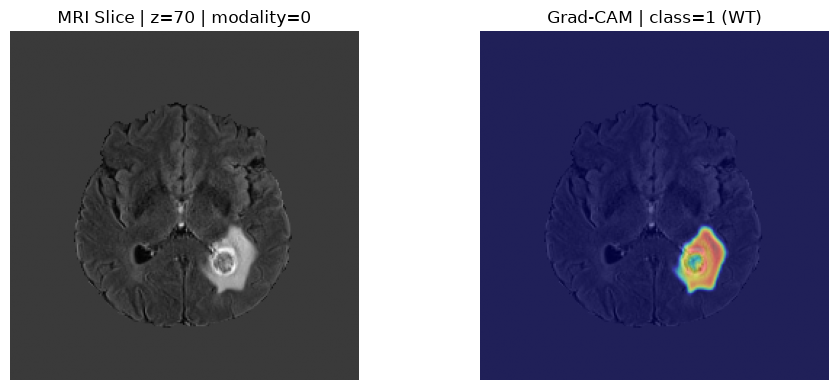
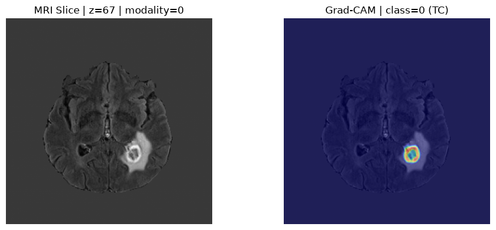

# Large Full-Volume 3D Segmentation GradCAM

For large 3D volumes such as BraTS MRI cases, we often cannot pass the full
case directly through a model trained on fixed-size patches like
``(96, 96, 96, 4)``. In those scenarios, we can still obtain a full-volume
Grad-CAM visualization by reusing the existing sliding-window
helpers:

- ``medicai.utils.extract_patches(...)`` to create overlapping windows and blending metadata
- ``medicai.utils.GradCAM.compute_heatmap(...)`` to compute CAMs for each patch batch
- ``medicai.utils.merge_patches(...)`` to reconstruct a full-volume heatmap

This example assumes that you have trained ``TransUNet`` model (or any segmentation model) on BraTS dataset using `medicai` and saved the best trained weight. Now, you want to compute ``GradCAM`` on target classes. For training details, check the BraTS code example.

```python
import numpy as np
import matplotlib.pyplot as plt
from tqdm.auto import tqdm
from keras import ops

from medicai.models import TransUNet
from medicai.utils import GradCAM, extract_patches, merge_patches
```

**Model and GradCAM**

```python
num_classes = 3
input_shape = (96, 96, 96, 4)

model = TransUNet(
    encoder_name="seresnext50",
    input_shape=input_shape,
    num_classes=num_classes,
    classifier_activation=None,
)
model.load_weights(
    "brats.model.weights.h5"
)

grad_cam = GradCAM(
    model=model,
    target_layer="decoder_act_1",
    task_type="auto",
)

label_map = {
    0: "TC",
    1: "WT",
    2: "ET",
}
```

**Helper Functions**: The helpers below keep the code organized while still relying only on existing ``medicai`` APIs.

```python
def iter_slice_batches(slices, sw_batch_size):
    """Yield consecutive slice batches."""
    for start in range(0, len(slices), sw_batch_size):
        yield slices[start : start + sw_batch_size]


def build_patch_batch(padded_inputs, batch_slices):
    """Create one patch batch from sliding-window slice metadata."""
    patch_list = []
    for slice_idx in batch_slices:
        full_slice = (slice(None),) + slice_idx + (slice(None),)
        patch_list.append(padded_inputs[full_slice])
    return np.concatenate(patch_list, axis=0)


def maybe_pad_patch_batch(
    patches, sw_batch_size, batch_size, has_multiple_patch_batches
):
    """
    Pad patch batch so repeated model calls keep the same leading dimension.
    Returns padded patches and the original unpadded batch size.
    """
    actual_patch_batch = patches.shape[0]
    target_patch_batch = sw_batch_size * batch_size

    if has_multiple_patch_batches and actual_patch_batch < target_patch_batch:
        batch_pad_size = ((0, target_patch_batch - actual_patch_batch),) + ((0, 0),) * (
            patches.ndim - 1
        )
        patches = np.pad(
            patches, batch_pad_size, mode="constant", constant_values=0
        )

    return patches, actual_patch_batch


def normalize_full_cam(full_cam):
    """Apply ReLU-style clipping and global max normalization."""
    full_cam = np.maximum(full_cam, 0.0)
    cam_max = full_cam.max()
    if cam_max > 0:
        full_cam = full_cam / cam_max
    return full_cam.astype("float32")


def get_best_axial_slice(full_cam):
    """
    Pick the axial slice with the strongest overall CAM response.

    Args:
        full_cam: np.ndarray with shape (1, D, H, W, 1)

    Returns:
        int: best z-index
    """
    cam_3d = full_cam[0, ..., 0]
    slice_scores = cam_3d.sum(axis=(1, 2))
    return int(np.argmax(slice_scores))


def plot_full_volume_gradcam(
    x,
    full_cam,
    target_class_index,
    label_map=None,
    slice_idx=None,
    modality_idx=0,
    alpha=0.45,
    image_cmap="gray",
    cam_cmap="jet",
):
    """Plot one slice and its Grad-CAM overlay."""
    if slice_idx is None:
        slice_idx = x.shape[1] // 2

    class_name = (
        label_map.get(target_class_index, str(target_class_index))
        if label_map is not None
        else str(target_class_index)
    )

    img_slice = x[0, slice_idx, :, :, modality_idx]
    cam_slice = full_cam[0, slice_idx, :, :, 0]

    plt.figure(figsize=(10, 4))

    plt.subplot(1, 2, 1)
    plt.imshow(img_slice, cmap=image_cmap)
    plt.title(f"MRI Slice | z={slice_idx} | modality={modality_idx}")
    plt.axis("off")

    plt.subplot(1, 2, 2)
    plt.imshow(img_slice, cmap=image_cmap)
    plt.imshow(cam_slice, cmap=cam_cmap, alpha=alpha)
    plt.title(f"Grad-CAM | class={target_class_index} ({class_name})")
    plt.axis("off")

    plt.tight_layout()
    plt.show()
```

**Prepare a Full Validation/Test Case**: This pattern assumes the transformed validation or test case may still have a variable spatial shape. The sliding-window utilities handle patch extraction and merging for us.

```python
index = 0
dataset = tf.data.TFRecordDataset(val_datalist[index])
dataset = dataset.map(parse_tfrecord_fn, num_parallel_calls=tf.data.AUTOTUNE)
dataset = dataset.map(rearrange_shape, num_parallel_calls=tf.data.AUTOTUNE)
sample = next(iter(dataset))
pre_image, pre_label = test_transformation(sample)

# Full transformed case, still variable-sized.
x = ops.convert_to_numpy(pre_image)[None, ...].astype("float32")

# BraTS channels: 0=TC, 1=WT, 2=ET
target_class_index = 1

roi_size = (96, 96, 96)
sw_batch_size = 2
overlap = 0.5
mode = "gaussian"
sigma_scale = 0.125
```

**Extract Overlapping Patches**

```python
padded_inputs, info = extract_patches(
    inputs=x,
    roi_size=roi_size,
    overlap=overlap,
    mode=mode,
    sigma_scale=sigma_scale,
)
```

**Patch Generator for ``merge_patches(...)``**: The following generator matches the tuple contract expected by ``merge_patches(...)`` and adds a progress bar via ``tqdm``.

```python
def gradcam_patch_generator(
    grad_cam,
    padded_inputs,
    info,
    sw_batch_size,
    target_class_index,
    mask_type="all",
    show_progress=True,
):
    """
    Yield tuples shaped like:
        (heatmaps, batch_slices, importance_map)
    so merge_patches(...) can reconstruct the full-volume CAM.
    """
    slices = info["slices"]
    batch_size = info["batch_size"]
    importance_map = info["importance_map"]
    has_multiple_patch_batches = len(slices) > sw_batch_size

    slice_batches = list(iter_slice_batches(slices, sw_batch_size))
    iterator = slice_batches
    if show_progress:
        iterator = tqdm(
            slice_batches,
            desc=f"Grad-CAM windows ({len(slices)} positions)",
            total=len(slice_batches),
        )

    for batch_slices in iterator:
        patches = build_patch_batch(padded_inputs, batch_slices)
        patches, actual_patch_batch = maybe_pad_patch_batch(
            patches=patches,
            sw_batch_size=sw_batch_size,
            batch_size=batch_size,
            has_multiple_patch_batches=has_multiple_patch_batches,
        )

        heatmaps = grad_cam.compute_heatmap(
            input_tensor=patches,
            target_class_index=target_class_index,
            mask_type=mask_type,
            normalize_heatmap=False,
            resize_heatmap=True,
        )

        heatmaps = heatmaps[:actual_patch_batch].astype("float32")
        yield heatmaps, batch_slices, importance_map
```

For BraTS-style overlapping target channels, ``mask_type="all"`` is a safer
default than ``"object"``.

**Merge Patch Heatmaps Back to the Full Volume**

```python
full_cam = merge_patches(
    patch_generator=gradcam_patch_generator(
        grad_cam=grad_cam,
        padded_inputs=padded_inputs,
        info=info,
        sw_batch_size=sw_batch_size,
        target_class_index=target_class_index,
        mask_type="all",
        show_progress=True,
    ),
    info=info,
    num_classes=1,
)

full_cam = normalize_full_cam(full_cam)
print("input shape:", x.shape)
print("full_cam shape:", full_cam.shape)
```
```
input shape: (1, 155, 240, 240, 4)
full_cam shape: (1, 155, 240, 240, 1)
```

**Visualize One Slice**

```python
plot_full_volume_gradcam(
    x=x,
    full_cam=full_cam,
    target_class_index=target_class_index,
    label_map=label_map,
    slice_idx=get_best_axial_slice(full_cam), #x.shape[1] // 2
    modality_idx=0,
)
```


With ``target_class_index=2``:


With ``target_class_index=0``:

