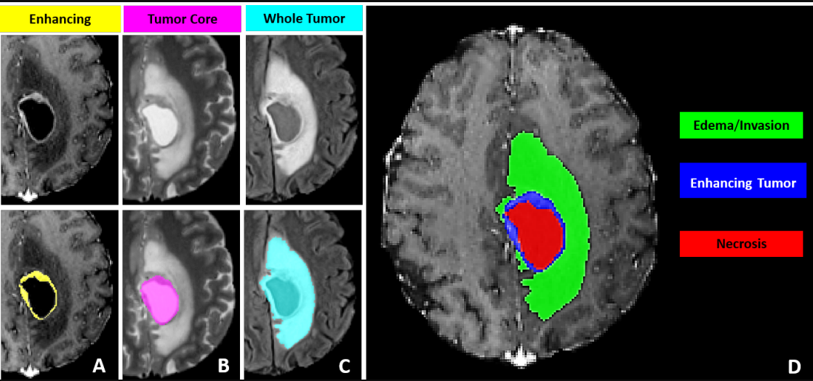
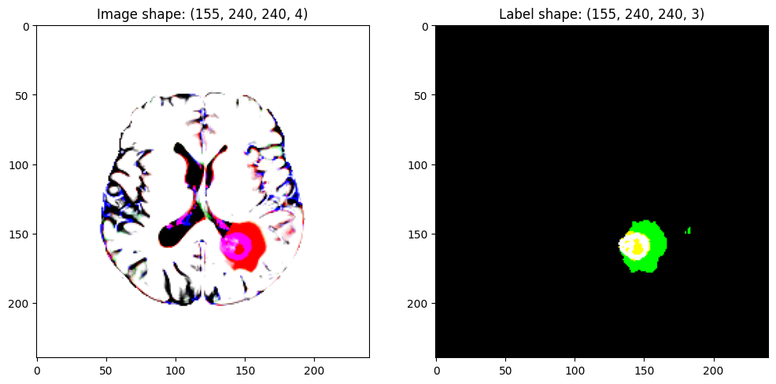
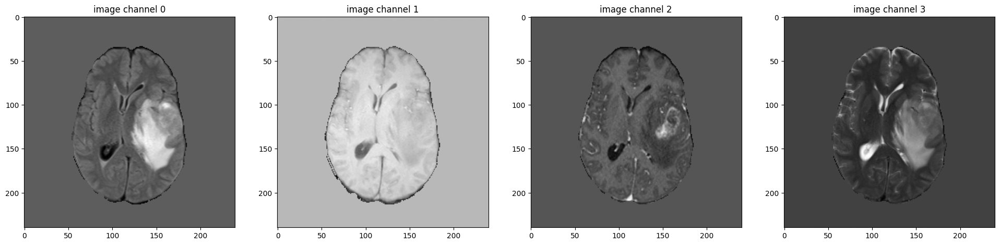
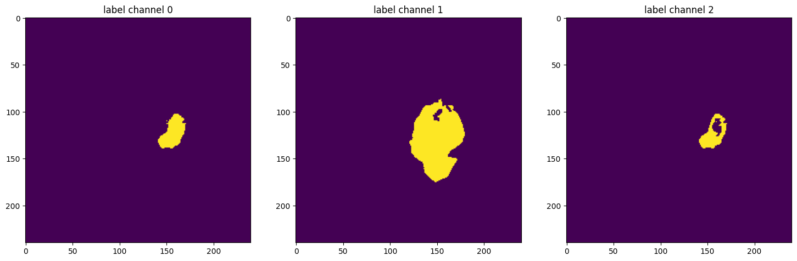
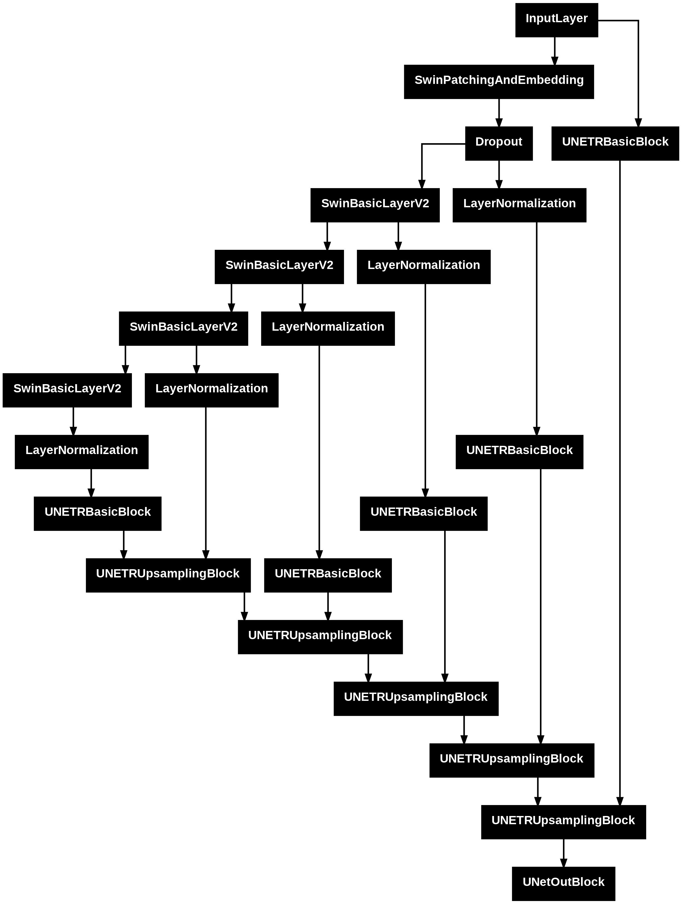
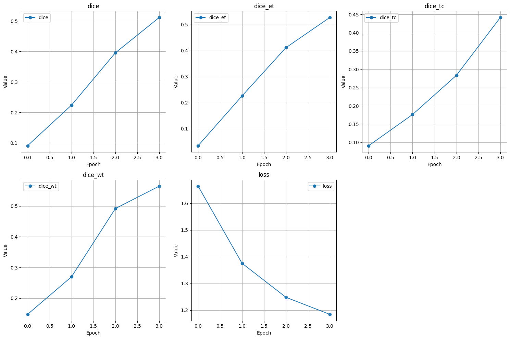
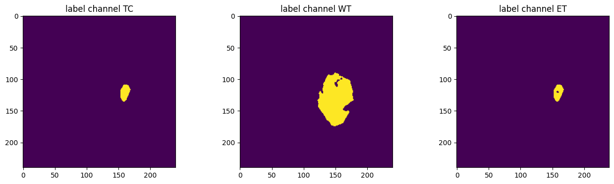
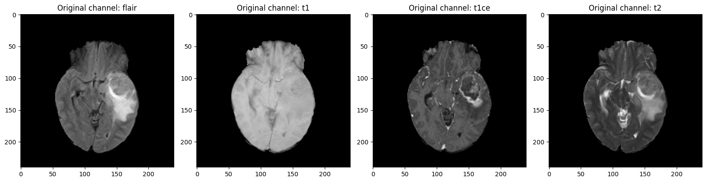
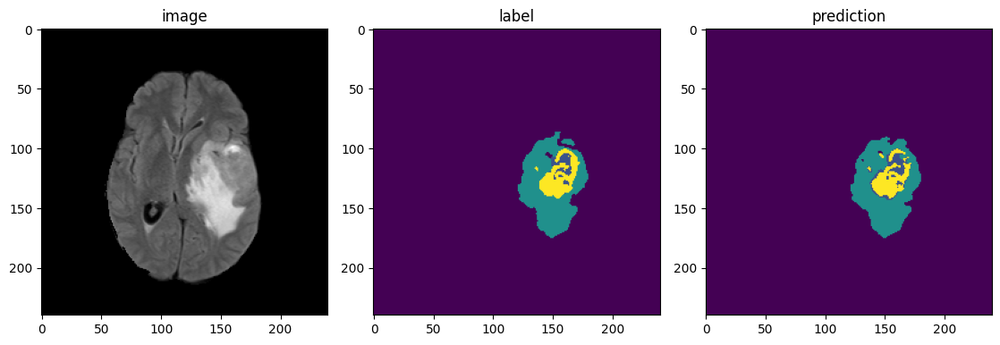

# Multimodal Brain Tumor Segmentation

Brain tumor segmentation is a core task in medical image analysis, where the goal is to automatically identify and label different tumor sub-regions from ``3D`` MRI scans. Accurate segmentation helps clinicians with diagnosis, treatment planning, and disease monitoring. In this tutorial, we focus on multimodal MRI-based brain tumor segmentation using the widely adopted [**BraTS**](https://ieeexplore.ieee.org/document/6975210) (**Brain Tumor Segmentation**) dataset.

---
## BraTS Dataset

The **BraTS** dataset provides multimodal 3D brain MRI scans, released as NIfTI files (``.nii.gz``). For each patient, four MRI modalities are available:

- **T1** – native T1-weighted MRI
- **T1Gd** – post-contrast T1-weighted MRI
- **T2** – T2-weighted MRI
- **T2-FLAIR** – Fluid Attenuated Inversion Recovery MRI

These scans are collected using different scanners and clinical protocols from 19 institutions, making the dataset diverse and realistic. More details about the dataset can be found in the official [BraTS documentation](https://www.med.upenn.edu/cbica/brats2020/data.html).

**Segmentation Labels**: Each scan is manually annotated by **one to four expert raters**, following a standardized annotation protocol and reviewed by experienced neuroradiologists. The segmentation masks contain the following tumor sub-regions:

- **NCR / NET (label 1)** – Necrotic and non-enhancing tumor core
- **ED (label 2)** – Peritumoral edema
- **ET (label 4)** – GD-enhancing tumor
- **0** – Background (non-tumor tissue)

The data are released after preprocessing:

- All modalities are **co-registered**
- Resampled to ``1 mm³`` isotropic resolution
- **Skull-stripped** for consistency


**Dataset Format**: The original BraTS scans are provided as ``.nii`` files.
This example reads the NIfTI files directly and uses PyGrain to build the
training and validation input pipelines. Since BraTS does not provide
publicly available ground-truth labels for validation or test sets, we hold
out a subset of cases from training for validation.

---

In this tutorial, we provide a step-by-step, end-to-end workflow for brain tumor segmentation. We will walk through:

1. **Loading the Dataset**
    - Discover the four modality files and segmentation mask for each case.
    - Build efficient PyGrain pipelines for training and evaluation.
2. **Medical Image Preprocessing**
    - Apply image transformations provided by ``medicai`` to prepare the data for model input.
3. **Model Building**
    - Construct a 3D segmentation model with [`SwinUNETR`](https://arxiv.org/abs/2201.01266) You can also experiment with other available 3D architectures in ``medicai``, including [`UNETR`](https://arxiv.org/abs/2103.10504), [`SegFormer`](https://arxiv.org/abs/2404.10156), and [`UNETR++`](https://ieeexplore.ieee.org/document/10526382).
4. **Loss and Metrics Definition**
    - Using Dice-based loss functions and segmentation metrics tailored for medical imaging.
5. **Model Evaluation**
    - Performing inference on large ``3D`` volumes using **sliding window inference**.
    - Computing per-class evaluation metrics.
6. **Visualization of Results**
    - Visualizing predicted segmentation masks for qualitative analysis.


```{note}
This example uses two Tesla T4 GPUs available in the Kaggle environment. You can also run it on a TPU VM. The only required change is to switch the mixed precision policy from ``mixed_float16`` to ``mixed_bfloat16``. You can also run this code example directly on Kaggle with either Multi-GPU or TPU-VM. Kaggle [notebook](https://www.kaggle.com/code/ipythonx/medicai-3d-brats-segmentation-in-keras/).
```

## Installation

```python
from IPython.display import clear_output

!pip install keras -qU
!pip install grain -qU
!pip install git+https://github.com/innat/medic-ai.git -qU

clear_output()
```

## Imports

```python
import os, warnings
os.environ["KERAS_BACKEND"] = "torch" # choose any: 'tensorflow', 'torch', 'jax'
warnings.filterwarnings('ignore')

import numpy as np
import pandas as pd
import nibabel as nib
import grain.python as pygrain

import keras
from keras import ops

from matplotlib import pyplot as plt
import matplotlib.animation as animation
from matplotlib.colors import ListedColormap

from medicai.transforms import (
    Compose,
    CropForeground,
    RandomShiftIntensity,
    RandomFlip,
    RandomSpatialCrop,
    NormalizeIntensity,
    LambdaTransform,
)
from medicai.models import SwinUNETR
from medicai.metrics import BinaryDiceMetric
from medicai.losses import BinaryDiceCELoss
from medicai.utils.inference import SlidingWindowInference
from medicai.callbacks import SlidingWindowInferenceCallback

# Disable flash attention for distributed training compatibility.
keras.config.disable_flash_attention()

# Enable mixed precision.
keras.mixed_precision.set_global_policy("mixed_float16")

# reproducibility
keras.utils.set_random_seed(101)

print(
    f"keras backend: {keras.config.backend()}\n"
    f"keras version: {keras.version()}\n"
)
```
```bash
keras backend: torch
keras version: 3.15.1
```

### Distributed Settings

The ``DataParallel`` class in the Keras distribution API is designed for the data parallelism strategy in distributed training.

```python
try:
    devices = keras.distribution.list_devices()
    data_parallel = keras.distribution.DataParallel(devices=devices)
    keras.distribution.set_distribution(data_parallel)
    total_device = len(devices)
except Exception:
    # Keras distribution support depends on the active backend.
    total_device = 1
```

## Prepare Multi-label Brain Tumor Labels

The BraTS segmentation task involves multiple tumor sub-regions, and it is formulated as a multi-label segmentation problem. The label combinations are used to define the following clinical regions of interest:

```shell
- Tumor Core (TC): label = 1 or 4
- Whole Tumor (WT): label = 1 or 2 or 4
- Enhancing Tumor (ET): label = 4
```

These region-wise groupings allow for evaluation across different tumor structures relevant for clinical assessment and treatment planning. A sample view is shown below, figure taken from [BraTS-benchmark](https://arxiv.org/abs/2107.02314) paper.




```python
def process_brats_targets(label):
    """Convert BraTS labels to TC, WT, and ET channels using ``keras.ops``.

    Label definitions:
    - 1: necrotic and non-enhancing tumor core
    - 2: peritumoral edema
    - 4: GD-enhancing tumor

    Output channels:
    - Channel 0 (TC): Tumor core (labels 1 or 4)
    - Channel 1 (WT): Whole tumor (labels 1, 2, or 4)
    - Channel 2 (ET): Enhancing tumor (label 4)
    """
    label = ops.convert_to_tensor(label)

    shape = label.shape
    if shape is not None and len(shape) > 0 and shape[-1] == 1:
        label = ops.squeeze(label, axis=-1)

    tc = ops.logical_or(ops.equal(label, 1), ops.equal(label, 4))
    wt = ops.logical_or(tc, ops.equal(label, 2))
    et = ops.equal(label, 4)

    return ops.stack(
        [
            ops.cast(tc, "float32"),
            ops.cast(wt, "float32"),
            ops.cast(et, "float32"),
        ],
        axis=-1,
    )
```

## Transformation

Each ``medicai`` transformation expects the input to have the shape
``(depth, height, width, channel)``. The original **NIfTI** arrays contain the
spatial shape ``(height, width, depth)``. To make them compatible with
``medicai``, we rearrange the spatial axes before applying the pipeline.


```python
def depth_first(sample):
    """Convert NIfTI arrays from ``(H, W, D, C)`` to ``(D, H, W, C)``."""
    image = ops.transpose(sample["image"], (2, 1, 0, 3))
    label = ops.transpose(sample["label"], (2, 1, 0))
    return image, label
```

Each transformation class of ``medicai`` expects input as either a dictionary or a ``TensorBundle`` object. When a dictionary of input data (along with metadata) is passed, it is automatically wrapped into a ``TensorBundle`` instance.


```python
num_classes = 3
epochs = 25
input_shape = (96, 96, 96, 4)

def train_transformation(image, label):
    data = {"image": image, "label": label}
    pipeline = Compose([
        LambdaTransform(
            keys=["label"],
            fn=process_brats_targets,
            name="convert_brats_label",
        ),
        CropForeground(
            keys=("image", "label"),
            source_key="image",
            k_divisible=[96, 96, 96],
            input_layout="DHWC",
        ),
        RandomSpatialCrop(
            keys=["image", "label"],
            crop_size=(96, 96, 96),
            input_layout="DHWC",
        ),
        RandomFlip(
            keys=["image", "label"],
            spatial_axis=0,
            prob=0.5,
            input_layout="DHWC",
        ),
        RandomFlip(
            keys=["image", "label"],
            spatial_axis=1,
            prob=0.5,
            input_layout="DHWC",
        ),
        RandomFlip(
            keys=["image", "label"],
            spatial_axis=2,
            prob=0.5,
            input_layout="DHWC",
        ),
        NormalizeIntensity(
            keys=["image"],
            nonzero=True,
            channel_wise=True,
            input_layout="DHWC",
        ),
        RandomShiftIntensity(
            keys=["image"],
            offset=0.10,
            prob=1.0,
            input_layout="DHWC",
        )
    ])

    with keras.device("cpu:0"):
        result = pipeline(data)

    return result["image"], result["label"]


def val_transformation(image, label):
    data = {"image": image, "label": label}
    pipeline = Compose([
        LambdaTransform(
            keys=["label"],
            fn=process_brats_targets,
            name="convert_brats_label",
        ),
        NormalizeIntensity(
            keys=["image"],
            nonzero=True,
            channel_wise=True,
            input_layout="DHWC",
        )
    ])

    with keras.device("cpu:0"):
        result = pipeline(data)

    return result["image"], result["label"]
```

## Create Data Records

We will be using BraTS dataset from Kaggle, data [source](https://www.kaggle.com/datasets/awsaf49/brats20-dataset-training-validation).

```python
def load_datalist(root_dir):
    modalities = ["flair", "t1", "t1ce", "t2"]
    records = []

    for case in sorted(os.listdir(root_dir)):
        case_dir = os.path.join(root_dir, case)
        if not os.path.isdir(case_dir):
            continue

        image_paths = [
            os.path.join(case_dir, f"{case}_{modality}.nii")
            for modality in modalities
        ]
        label_path = os.path.join(case_dir, f"{case}_seg.nii")

        if all(os.path.exists(path) for path in image_paths + [label_path]):
            records.append({"image": image_paths, "label": label_path})

    return records

def load_nifti(sample):
    images = [
        nib.load(path).get_fdata(dtype=np.float32)
        for path in sample["image"]
    ]
    image = np.stack(images, axis=-1)  # (H, W, D, 4)
    label = nib.load(sample["label"]).get_fdata(dtype=np.float32)
    return {"image": image, "label": label.astype(np.uint8)}


root_dir = "/kaggle/input/brats20-dataset-training-validation"
data_dir = (
    f"{root_dir}/BraTS2020_TrainingData/"
    "MICCAI_BraTS2020_TrainingData"
)
records = load_datalist(data_dir)
validation_records = records[-8:]
train_records = records[:-8]

print(f"Training:   {len(train_records)}")
print(f"Validation: {len(validation_records)}")
```
```bash
Training:   360
Validation: 8
```

## Dataloader

```python
class BraTSDataset(pygrain.RandomAccessDataSource):
    def __init__(self, records):
        self.records = records

    def __len__(self):
        return len(self.records)

    def __getitem__(self, index):
        return self.records[index]


train_ds = (
    pygrain.MapDataset
    .source(BraTSDataset(train_records))
    .shuffle(seed=42)
    .map(load_nifti)
    .map(depth_first)
    .map(lambda sample: train_transformation(*sample))
    .batch(1 * total_device)
    .to_iter_dataset(read_options=pygrain.ReadOptions(num_threads=4))
)

val_ds = (
    pygrain.MapDataset
    .source(BraTSDataset(validation_records))
    .map(load_nifti)
    .map(depth_first)
    .map(lambda sample: val_transformation(*sample))
    .batch(1)
    .to_iter_dataset(read_options=pygrain.ReadOptions(num_threads=4))
)

```

The training batch size can be set to more than `1` depending on the environment and available resources. However, we intentionally keep the validation batch size as `1` to handle variable-sized samples more flexibly.


**sanity check**: Fetch a single validation sample to inspect its shape and values.

```python
val_x, val_y = next(iter(val_ds))
test_image = val_x.squeeze()
test_mask = val_y.squeeze()
print(test_image.shape, test_mask.shape, np.unique(test_mask))
print(test_image.min(), test_image.max())
```
```bash
(155, 240, 240, 4) (155, 240, 240, 3) [0. 1.]
-3.8107734 12.865826
```

**sanity check**: Visualize the middle slice of the image and its corresponding label.

```python
slice_no = test_image.shape[0] // 2

fig, (ax1, ax2) = plt.subplots(1, 2, figsize=(12, 6))
ax1.imshow(test_image[slice_no], cmap="gray")
ax1.set_title(f"Image shape: {test_image.shape}")
ax2.imshow(test_mask[slice_no])
ax2.set_title(f"Label shape: {test_mask.shape}")
plt.show()
```


    
**sanity check**: Visualize sample image and label channels at middle slice index.

```python
print(f"image shape: {test_image.shape}")
plt.figure("image", (24, 6))
for i in range(4):
    plt.subplot(1, 4, i + 1)
    plt.title(f"image channel {i}")
    plt.imshow(test_image[slice_no, :, :, i], cmap="gray")
plt.show()


print(f"label shape: {test_mask.shape}")
plt.figure("label", (18, 6))
for i in range(3):
    plt.subplot(1, 3, i + 1)
    plt.title(f"label channel {i}")
    plt.imshow(test_mask[slice_no, :, :, i])
plt.show()
```
```
image shape: (155, 240, 240, 4)
```

    
```
label shape: (155, 240, 240, 3)
```

    

## Model

We will be using the 3D model architecture Swin UNEt TRansformers, i.e., [`SwinUNETR`](https://arxiv.org/abs/2201.01266). It was used in the BraTS 2021 segmentation challenge by NVIDIA. The model was among the top-performing methods. It uses a Swin Transformer encoder to extract features at five different resolutions. A CNN-based decoder is connected to each resolution using skip connections.

The BraTS dataset provides four input modalities: ``flair``, ``t1``, ``t1ce``, and ``t2`` and three multi-label outputs: ``tumor-core``, ``whole-tumor``, and ``enhancing-tumor``. Accordingly, we will initiate the model with ``4`` input channels and ``3`` output channels.


```python
model = SwinUNETR(
    encoder_name="swin_tiny_v2",
    input_shape=input_shape,
    num_classes=num_classes,
    classifier_activation=None,
)

model.compile(
    optimizer=keras.optimizers.AdamW(
        learning_rate=1e-4,
        weight_decay=1e-5,
    ),
    loss=BinaryDiceCELoss(
        from_logits=True,
        num_classes=num_classes,
    ),
    metrics=[
        BinaryDiceMetric(
            from_logits=True,
            ignore_empty=True,
            num_classes=num_classes,
            name="dice",
        ),
        BinaryDiceMetric(
            from_logits=True,
            ignore_empty=True,
            target_class_ids=[0],
            num_classes=num_classes,
            name="dice_tc",
        ),
        BinaryDiceMetric(
            from_logits=True,
            ignore_empty=True,
            target_class_ids=[1],
            num_classes=num_classes,
            name="dice_wt",
        ),
        BinaryDiceMetric(
            from_logits=True,
            ignore_empty=True,
            target_class_ids=[2],
            num_classes=num_classes,
            name="dice_et",
        ),
    ],
)
```
```python
print(model.instance_describe())
```
```bash
Instance of SwinUNETR
  • input_shape: (96, 96, 96, 4)
  • encoder: SwinTinyV2(
    • input_shape: (96, 96, 96, 4)
    • include_rescaling: False
    • patch_size: (2, 2, 2)
    • window_size: (7, 7, 7)
    • dropout: 0.0
    • downsampling_strategy: 'swin_unetr_like'
    • name: 'SwinTinyV23D'
    )
  • encoder_name: 'swin_tiny_v2'
  • num_classes: 3
  • patch_size: 2
  • window_size: 7
  • classifier_activation: linear
  • feature_size: 48
  • res_block: True
  • norm_name: instance
```
```python
keras.utils.plot_model(model)
```


## Callback

We will be using sliding window inference callback from ``medicai`` to perform validation at certain interval or epoch during training. Based on the number of epoch size, we should set ``interval`` accordingly. For example, if epoch is set 15 and we want to evaluate model on validation set every 5 epoch, then we should set ``interval`` to ``5``.


```python
swi_callback_metric = BinaryDiceMetric(
    from_logits=True,
    ignore_empty=True,
    num_classes=num_classes,
    name="val_dice",
)

swi_callback = SlidingWindowInferenceCallback(
    model,
    dataset=val_ds,
    metrics=swi_callback_metric,
    num_classes=num_classes,
    interval=5,
    overlap=0.5,
    roi_size=input_shape[:3],
    sw_batch_size=4 * total_device,
    mode="gaussian",
    save_path="brats.model.weights.h5",
)
```

## Training

Set more epoch for better optimization.

```python
history = model.fit(
    train_ds, epochs=epochs, callbacks=[swi_callback]
)
```

Let’s take a quick look at how our model performed during training. We will first print the available metrics recorded in the training history, save them to a CSV file for future reference, and then visualize them to better understand the model’s learning progress over epochs.

```python
def plot_training_history(history_df):
    metrics = history_df.columns
    n_metrics = len(metrics)

    n_rows = 2
    n_cols = (n_metrics + 1) // 2  # ceiling division for columns

    plt.figure(figsize=(5 * n_cols, 5 * n_rows))

    for idx, metric in enumerate(metrics):
        plt.subplot(n_rows, n_cols, idx + 1)
        plt.plot(history_df[metric], label=metric, marker="o")
        plt.title(metric)
        plt.xlabel("Epoch")
        plt.ylabel("Value")
        plt.grid(True)
        plt.legend()

    plt.tight_layout()
    plt.show()


print(model.history.history.keys())
his_csv = pd.DataFrame(model.history.history)
his_csv.to_csv("brats.history.csv")
plot_training_history(his_csv)
```

```
dict_keys(['dice', 'dice_et', 'dice_tc', 'dice_wt', 'loss'])
```


    

## Evaluation

To evaluate the model, we perform sliding window inference on the validation dataset and compute Dice scores for overall segmentation quality as well as specific tumor subregions:
 - Tumor Core (TC)
 - Whole Tumor (WT)
 - Enhancing Tumor (ET)

```python
model.load_weights(
    "brats.model.weights.h5"
)

swi = SlidingWindowInference(
    model,
    num_classes=num_classes,
    roi_size=input_shape[:3],
    sw_batch_size=4 * total_device,
    overlap=0.5,
    mode="gaussian",
)

dice = BinaryDiceMetric(
    from_logits=True,
    ignore_empty=True,
    num_classes=num_classes,
    name="dice",
)
dice_tc = BinaryDiceMetric(
    from_logits=True,
    ignore_empty=True,
    target_class_ids=[0],
    num_classes=num_classes,
    name="dice_tc",
)
dice_wt = BinaryDiceMetric(
    from_logits=True,
    ignore_empty=True,
    target_class_ids=[1],
    num_classes=num_classes,
    name="dice_wt",
)
dice_et = BinaryDiceMetric(
    from_logits=True,
    ignore_empty=True,
    target_class_ids=[2],
    num_classes=num_classes,
    name="dice_et",
)
```

Due to the variable size, and larger size of the validation data, we iterate over the validation dataloader. The sliding window inference handles input patches and computes the predictions for each batch.

```python
dice.reset_state()
dice_tc.reset_state()
dice_wt.reset_state()
dice_et.reset_state()

for sample in val_ds:
    x, y = sample
    output = swi(x)
    dice.update_state(y, output)
    dice_tc.update_state(y, output)
    dice_wt.update_state(y, output)
    dice_et.update_state(y, output)

dice_score = float(ops.convert_to_numpy(dice.result()))
dice_score_tc = float(ops.convert_to_numpy(dice_tc.result()))
dice_score_wt = float(ops.convert_to_numpy(dice_wt.result()))
dice_score_et = float(ops.convert_to_numpy(dice_et.result()))

print(f"Dice Score: {dice_score:.4f}")
print(f"Dice Score on tumor core (TC): {dice_score_tc:.4f}")
print(f"Dice Score on whole tumor (WT): {dice_score_wt:.4f}")
print(f"Dice Score on enhancing tumor (ET): {dice_score_et:.4f}")
```

```bash
Dice Score: 0.7939
Dice Score on tumor core (TC): 0.6186
Dice Score on whole tumor (WT): 0.9184
Dice Score on enhancing tumor (ET): 0.8446
```

## Analyse and Visualize

Let's analyse the model predictions and visualize them. First, let's load one validation case through PyGrain and check its properties.

```python
dataset = (
    pygrain.MapDataset
    .source(BraTSDataset(validation_records))
    .map(load_nifti)
    .map(depth_first)
)
sample = next(iter(dataset))
orig_image, orig_label = sample
print(
    orig_image.shape, orig_label.shape, np.unique(ops.convert_to_numpy(orig_label))
)
```
```bash
(155, 240, 240, 4) (155, 240, 240) [0 1 2 4]
```
Run the transformation to prepare the inputs.

```python
pre_image, pre_label = val_transformation(*sample)
print(
    pre_image.shape, pre_label.shape
)
```
```bash
torch.Size([155, 240, 240, 4]) torch.Size([155, 240, 240, 3])
```
Pass the preprocessed sample to the inference object, ensuring that a batch axis is added to the input beforehand.

```python
y_pred = swi(pre_image[None, ...])
print(y_pred.shape)
```
```bash
(1, 155, 240, 240, 3)
```
After running inference, we remove the batch dimension and apply a ``sigmoid`` activation to obtain class probabilities. We then threshold the probabilities at ``0.5`` to generate the final binary segmentation map.

```python
y_pred_logits = y_pred.squeeze(axis=0)
y_pred_prob = ops.convert_to_numpy(ops.sigmoid(y_pred_logits))
segment = (y_pred_prob > 0.5).astype(int)
print(segment.shape, np.unique(segment))
```
```bash
((155, 240, 240, 3), array([0, 1]))
```

We compare the ground truth (``pre_label``) and the predicted segmentation (``segment``) for each tumor sub-region. Each sub-plot shows a specific channel corresponding to a tumor type: TC, WT, and ET. Here we visualize the ``80th`` axial slice across the three channels.

```python
label_map = {0: "TC", 1: "WT", 2: "ET"}

plt.figure(figsize=(16, 4))
for i in range(pre_label.shape[-1]):
    plt.subplot(1, 3, i + 1)
    plt.title(f"label channel {label_map[i]}")
    plt.imshow(pre_label[80, :, :, i])
plt.show()

plt.figure(figsize=(16, 4))
for i in range(3):
    plt.subplot(1, 3, i + 1)
    plt.title(f"pred channel {label_map[i]}")
    plt.imshow(segment[80, :, :, i])
plt.show()
```
    



    

The predicted output is a multi-channel binary map, where each channel corresponds to a specific tumor region. To visualize it against the original ground truth, we convert it into a single-channel label map. Here we assign:
- Label ``1`` for Tumor Core (TC)
- Label ``2`` for Whole Tumor (WT)
- Label ``4`` for Enhancing Tumor (ET)

The label values are chosen to match typical conventions used in medical segmentation benchmarks like BraTS.

```python
prediction = np.zeros(
    (segment.shape[0], segment.shape[1], segment.shape[2]), dtype="float32"
)
prediction[segment[..., 1] == 1] = 2
prediction[segment[..., 0] == 1] = 1
prediction[segment[..., 2] == 1] = 4

print('label ', orig_label.shape, np.unique(ops.convert_to_numpy(orig_label)))
print('predicted ', prediction.shape, np.unique(ops.convert_to_numpy(prediction)))
```
```bash
label  (155, 240, 240) [0 1 2 4]
predicted  (155, 240, 240) [0. 1. 2. 4.]
```

Let's begin by examining the original input slices from the MRI scan. The input contains four channels corresponding to different MRI modalities:
- FLAIR
- T1
- T1CE (T1 with contrast enhancement)
- T2

We display the same slice number across all modalities for comparison.

```python
slice_map = {0: "flair", 1: "t1", 2: "t1ce", 3: "t2"}
slice_num = 75

plt.figure(figsize=(16, 4))
for i in range(orig_image.shape[-1]):
    plt.subplot(1, 4, i + 1)
    plt.title(f"Original channel: {slice_map[i]}")
    plt.imshow(orig_image[slice_num, :, :, i], cmap="gray")

plt.tight_layout()
plt.show()
```


Next, we compare this input with the ground truth label and the predicted segmentation on the same slice. This provides visual insight into how well the model has localized and segmented the tumor regions.

```python
num_channels = orig_image.shape[-1]
plt.figure("image", (15, 15))

# plotting image, label and prediction
plt.subplot(3, num_channels, num_channels + 1)
plt.title("image")
plt.imshow(orig_image[slice_num, :, :, 0], cmap="gray")

plt.subplot(3, num_channels, num_channels + 2)
plt.title("label")
plt.imshow(orig_label[slice_num, :, :])

plt.subplot(3, num_channels, num_channels + 3)
plt.title("prediction")
plt.imshow(prediction[slice_num, :, :])

plt.tight_layout()
plt.show()
```
    


---

Finally, let's create a clean GIF visualizer showing the input image, ground-truth label, and model prediction.


```python
# The input volume contains large black margins, so we crop
# the foreground region of interest (ROI).
crop_foreground = CropForeground(
    keys=("image", "label", "prediction"), source_key="image"
)

data = {
    "image": orig_image,
    "label": orig_label[..., None],
    "prediction": prediction[..., None],
}
results = crop_foreground(data)
crop_orig_image = results["image"]
crop_orig_label = results["label"]
crop_prediction = results["prediction"]
```

Prepare a visualization-friendly prediction map by remapping label values to a compact index range.

```python
viz_pred = np.zeros_like(crop_prediction, dtype="uint8")
viz_pred[crop_prediction == 1] = 1
viz_pred[crop_prediction == 2] = 2
viz_pred[crop_prediction == 4] = 3

# Colormap for background, tumor core, edema, and enhancing regions
cmap = ListedColormap(
    [
        "#000000",  # background
        "#E57373",  # muted red
        "#64B5F6",  # muted blue
        "#81C784",  # muted green
    ]
)

# Create side-by-side views for input, label, and prediction
fig, axes = plt.subplots(1, 3, figsize=(10, 4))
ax_img, ax_lbl, ax_pred = axes

img_im = ax_img.imshow(crop_orig_image[0, :, :, 0], cmap="gray")
lbl_im = ax_lbl.imshow(
    crop_orig_label[0], vmin=0, vmax=3, cmap=cmap, interpolation="nearest"
)
pred_im = ax_pred.imshow(
    viz_pred[0], vmin=0, vmax=3, cmap=cmap, interpolation="nearest"
)

# Tight layout for a compact GIF
plt.subplots_adjust(left=0.01, right=0.99, bottom=0.02, top=0.8, wspace=0.01)

for ax, t in zip(axes, ["FLAIR", "Label", "Prediction"]):
    ax.set_title(t, fontsize=19, pad=10)
    ax.axis("off")
    ax.set_adjustable("box")


def update(i):
    img_im.set_data(crop_orig_image[i, :, :, 0])
    lbl_im.set_data(crop_orig_label[i])
    pred_im.set_data(viz_pred[i])
    fig.suptitle(f"Slice {i}", fontsize=14)
    return img_im, lbl_im, pred_im


ani = animation.FuncAnimation(
    fig, update, frames=crop_orig_image.shape[0], interval=120
)
ani.save(
    "segmentation_slices.gif",
    writer="pillow",
    dpi=100,
)
plt.close(fig)
```
