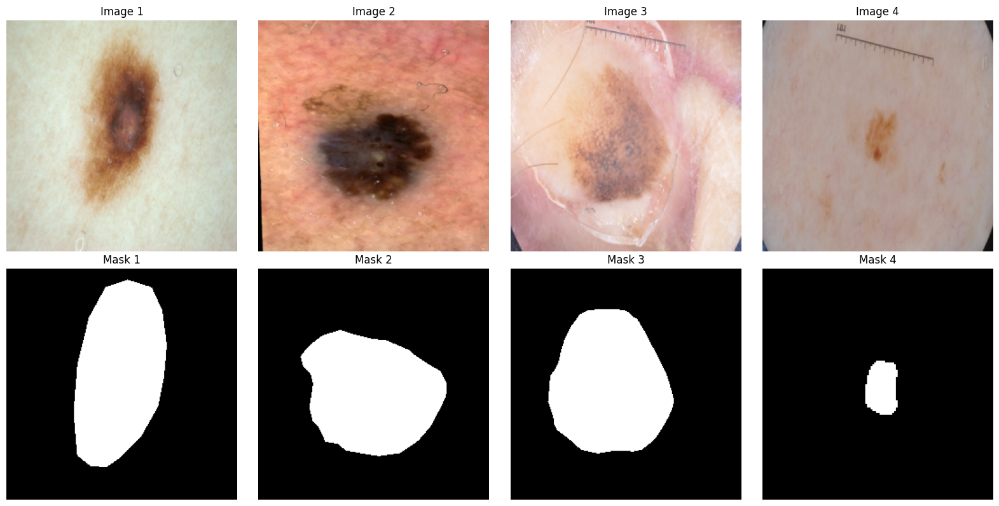
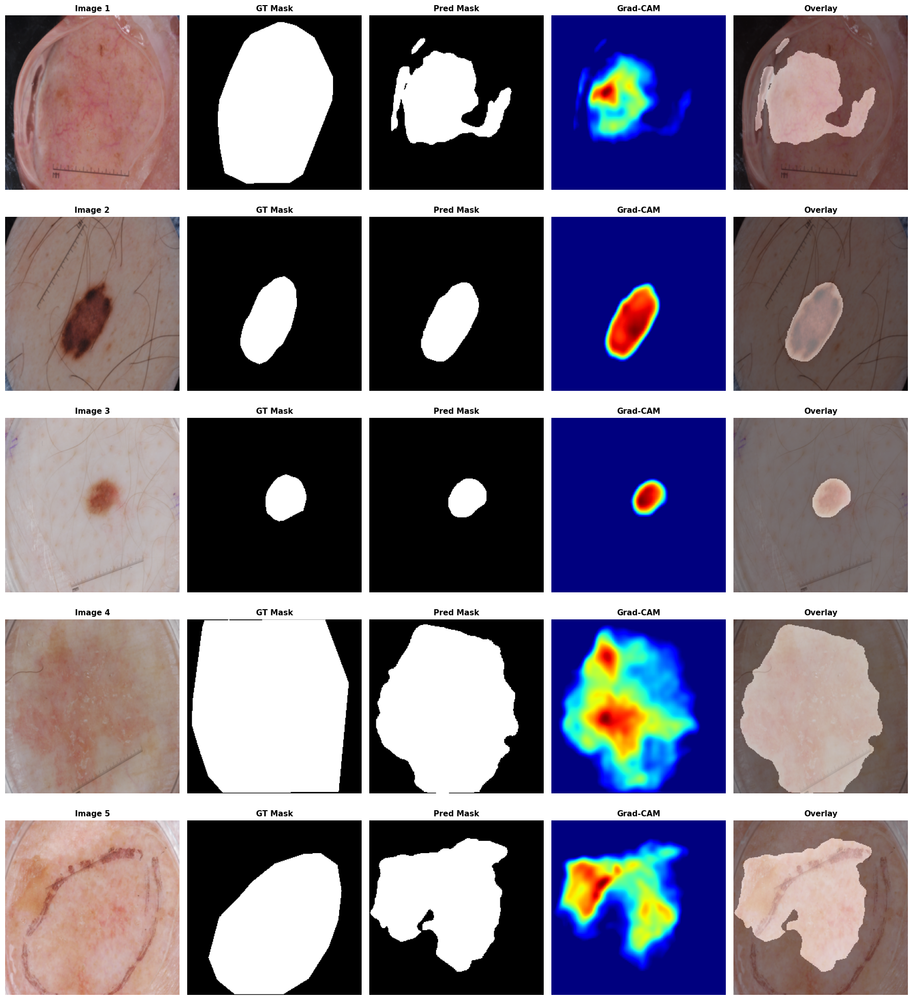

# Melanoma Binary Segmentation

In this tutorial, we are going to cover:

- Load the **ISIC 2017** dataset, a binary 2D segmentation dataset.
- Build a data loader using the ``torch.utils.data`` API.
- Construct a model.
- Train the model using the pure ``torch`` training API.
- Compute **GradCAM** visualizations.


The **ISIC 2017** Challenge, short for the International Skin Imaging Collaboration Challenge 2017, was a major competition focused on automated skin lesion analysis using dermoscopic images. It aimed to advance machine learning and computer vision methods for melanoma detection, which is one of the deadliest forms of skin cancer. 

The official ISIC-2017 dataset is uploaded to Kaggle; please check the [about section](https://www.kaggle.com/datasets/ipythonx/isic-2017-challenge-datasets) of the dataset. This example assumes you are either running inside a Kaggle notebook with that dataset attached, or you have downloaded the dataset locally and updated ``data_dir`` to point to it.

## Setup

```python
pip install git+https://github.com/innat/medic-ai.git -q
```

## Imports

```python
import os
os.environ["KERAS_BACKEND"] = "torch"

import numpy as np
import pandas as pd
from tqdm import tqdm

from pathlib import Path
from matplotlib import pyplot as plt

import keras
from keras import ops

import medicai
from medicai.utils import GradCAM
from medicai.models import AttentionUNet

import torch
import torch.nn as nn
import torch.optim as optim
from torch.utils.data import Dataset, DataLoader

import albumentations as A
from pathlib import Path
from PIL import Image

print(
    f"keras backend: {keras.config.backend()}\n"
    f"keras version: {keras.version()}\n"
    f"torch version: {torch.__version__}\n"
)
```
```bash
keras backend: torch
keras version: 3.13.2
torch version: 2.10.0+cu128
```

## Data Loader

We prepare the ISIC data with a custom ``Dataset`` class so each sample returns a dermoscopic image together with its corresponding binary lesion mask. In this stage, we resize images and masks to a fixed resolution, normalize pixel values, and add lightweight augmentation to the training split to improve generalization.


```python
data_dir = Path("/kaggle/input/isic-2017-challenge-datasets")
input_size = 256
batch_size = 32
```

```python
transform = A.Compose([
    A.HorizontalFlip(p=0.5),
    A.VerticalFlip(p=0.5),
    A.RandomRotate90(p=0.5),
])


class ISICDataset(Dataset):
    def __init__(self, img_dir, mask_dir, transform=None):
        self.img_dir = Path(img_dir)
        self.mask_dir = Path(mask_dir)
        self.transform = transform
        
        # Collect all image and mask paths
        self.image_paths = sorted(self.img_dir.rglob("*.jpg"))
        self.mask_paths = [
            self.mask_dir / (p.stem + "_segmentation.png") 
            for p in self.image_paths
        ]

    def __len__(self):
        return len(self.image_paths)

    def __getitem__(self, idx):
        img_path = self.image_paths[idx]
        mask_path = self.mask_paths[idx]

        image = Image.open(img_path).convert("RGB")
        image = image.resize((input_size, input_size), Image.BILINEAR)
        image = np.array(image, dtype=np.float32) / 255.0 
         
        mask = Image.open(mask_path).convert("L")
        mask = mask.resize((input_size, input_size), Image.NEAREST)
        mask = np.array(
            mask, dtype=np.float32
        ) / 255.0  # normalize [0,1]
        mask = np.expand_dims(mask, axis=-1)  # (H, W, 1)

        if self.transform:
            augmented = self.transform(image=image, mask=mask)
            image, mask = augmented["image"], augmented["mask"]

        image = torch.from_numpy(image)
        mask = torch.from_numpy(mask)
        return image, mask
```

```python
# Create train dataset
train_img_dir = (
    data_dir 
    / "ISIC-2017_Training_Data" 
    / "ISIC-2017_Training_Data"
)
train_mask_dir = (
    data_dir
    / "ISIC-2017_Training_Part1_GroundTruth"
    / "ISIC-2017_Training_Part1_GroundTruth"
)
train_dataset = ISICDataset(
    train_img_dir, 
    train_mask_dir,
    transform,
)
train_loader = DataLoader(
    train_dataset, 
    batch_size=batch_size, 
    shuffle=True,
    pin_memory=True, 
    num_workers=4, 
    persistent_workers=True
)

# Create val dataset
val_img_dir = (
    data_dir 
    / "ISIC-2017_Validation_Data" 
    / "ISIC-2017_Validation_Data"
)
val_mask_dir = (
    data_dir
    / "ISIC-2017_Validation_Part1_GroundTruth"
    / "ISIC-2017_Validation_Part1_GroundTruth"
)
val_dataset = ISICDataset(
    val_img_dir, 
    val_mask_dir,
)
val_loader = DataLoader(
    val_dataset, 
    batch_size=batch_size, 
    shuffle=False,
    pin_memory=True, 
    num_workers=4, 
    persistent_workers=True
)
```

**visualization**

```python
# Example iteration
images, masks = next(iter(train_loader))
images, masks = (
    ops.convert_to_numpy(images), 
    ops.convert_to_numpy(masks)
)

n = min(4, len(images))
fig, axes = plt.subplots(2, n, figsize=(4 * n, 8))

for i in range(n):
    ax1 = axes[0, i]
    ax1.imshow(images[i])
    ax1.set_title(f"Image {i+1}")
    ax1.axis("off")

    ax2 = axes[1, i]
    ax2.imshow(masks[i], cmap="gray")
    ax2.set_title(f"Mask {i+1}")
    ax2.axis("off")

plt.tight_layout()
plt.show()
```



## Model

For this example, we use ``AttentionUNet`` as the segmentation model and pair it with an ``EfficientNet-B0`` encoder backbone. This gives us a practical 2D medical segmentation baseline that is expressive enough for lesion localization while still being straightforward to train and inspect.

```python
model = AttentionUNet(
    encoder_name='efficientnet_b0',
    input_shape=(
        input_size, input_size, 3
    ),
    num_classes=1,
    classifier_activation='sigmoid',
)
print(model.output)
model.count_params() / 1e6
```
## Training API

Instead of relying on ``model.fit``, this walkthrough uses an explicit PyTorch-style training loop. We first define reusable helpers for metric tracking, then implement separate training and validation passes so it is easy to monitor segmentation quality through loss, binary accuracy, and IoU after each epoch.

```python
class AverageMeter:
    def __init__(self):
        self.reset()

    def reset(self):
        self.val = 0
        self.avg = 0
        self.sum = 0
        self.count = 0

    def update(self, val, n=1):
        self.val = val
        self.sum += val * n
        self.count += n
        self.avg = self.sum / self.count
```
This helper keeps running averages for loss and segmentation metrics so epoch summaries reflect the full dataset rather than only the latest batch.

```python
def binary_accuracy(outputs, masks, threshold=0.5):
    preds = (outputs > threshold).float()
    correct = (preds == masks).float()
    return correct.mean()

def binary_iou(outputs, masks, threshold=0.5, eps=1e-6):
    preds = (outputs > threshold).float()
    intersection = (preds * masks).sum(dim=(1,2,3))
    union = (preds + masks - preds * masks).sum(dim=(1,2,3))
    iou = (intersection + eps) / (union + eps)
    return iou.mean()
```
These metric functions turn raw ``sigmoid`` predictions into binary masks and measure both pixel-wise agreement and overlap quality.

```python
def train_one_epoch(model, loader, criterion, optimizer, device):
    model.train()
    loss_meter = AverageMeter()
    acc_meter = AverageMeter()
    iou_meter = AverageMeter()
    
    loop = tqdm(loader, desc="Training", leave=False)
    
    for imgs, masks in loop:
        imgs = imgs.to(device)
        masks = masks.to(device)
        
        optimizer.zero_grad()
        outputs = model(imgs)
        loss = criterion(outputs, masks)
        loss.backward()
        optimizer.step()

        # Compute metrics
        batch_size = imgs.shape[0]
        acc = binary_accuracy(outputs, masks)
        iou = binary_iou(outputs, masks)
        
        # Update meters
        loss_meter.update(loss.item(), batch_size)
        acc_meter.update(acc.item(), batch_size)
        iou_meter.update(iou.item(), batch_size)
        
        # Update tqdm
        loop.set_postfix(
            loss=loss_meter.avg,
            acc=acc_meter.avg,
            iou=iou_meter.avg
        )

    return loss_meter.avg, acc_meter.avg, iou_meter.avg
```
The training pass performs forward and backward propagation, updates the optimizer, and tracks average loss, accuracy, and IoU for the full epoch.

```python
def validate(model, loader, criterion, device):
    model.eval()
    loss_meter = AverageMeter()
    acc_meter = AverageMeter()
    iou_meter = AverageMeter()
    loop = tqdm(loader, desc="Validation", leave=False)
    
    with torch.no_grad():
        for imgs, masks in loop:
            imgs = imgs.to(device)
            masks = masks.to(device)
            
            outputs = model(imgs)
            
            # Compute metrics
            batch_size = imgs.shape[0]
            loss = criterion(outputs, masks)
            acc = binary_accuracy(outputs, masks)
            iou = binary_iou(outputs, masks)
            
            # Update meters
            loss_meter.update(loss.item(), batch_size)
            acc_meter.update(acc.item(), batch_size)
            iou_meter.update(iou.item(), batch_size)
            
            # Update tqdm
            loop.set_postfix(
                val_loss=loss_meter.avg,
                val_acc=acc_meter.avg,
                val_iou=iou_meter.avg
            )

    return loss_meter.avg, acc_meter.avg, iou_meter.avg
```
The validation pass mirrors training without gradient updates, giving us an unbiased snapshot of generalization after each epoch.

```python
def run_training(
    train_loader, val_loader, model, device='cuda', epochs=20, lr=1e-3
):
    criterion = nn.BCELoss()
    optimizer = optim.Adam(model.parameters(), lr=lr)

    for epoch in range(epochs):
        print(f'Epoch {epoch+1}/{epochs}')
        
        # Training
        train_loss, train_acc, train_iou = train_one_epoch(
            model, train_loader, criterion, optimizer, device
        )
        
        # Validation
        val_loss, val_acc, val_iou = validate(
            model, val_loader, criterion, device
        )
        
        # Print epoch summary
        print(
            f"Train | Loss: {train_loss:.4f} | "
            f"Acc: {train_acc:.4f} | "
            f"IoU: {train_iou:.4f}"
        )
        print(
            f"Val   | Loss: {val_loss:.4f} | "
            f"Acc: {val_acc:.4f} | "
            f"IoU: {val_iou:.4f}"
        )
        print()
```
This wrapper ties the whole optimization loop together by constructing the loss and optimizer once, then alternating between training and validation for each epoch.

```python
run_training(
    train_loader, val_loader, model, device='cuda', epochs=20
)
```

## Evaluation

After optimization, we build a dedicated test loader and evaluate the trained model on unseen ISIC test images. This provides a final summary of segmentation performance using the same metrics tracked during validation, making it easier to compare training progress with held-out test behavior.

```python
test_img_dir = (
    data_dir 
    / "ISIC-2017_Test_v2_Data" 
    / "ISIC-2017_Test_v2_Data"
)
test_mask_dir = (
    data_dir
    / "ISIC-2017_Test_v2_Part1_GroundTruth"
    / "ISIC-2017_Test_v2_Part1_GroundTruth"
)
test_dataset = ISICDataset(
    test_img_dir,  
    test_mask_dir,
)
test_loader = DataLoader(
    test_dataset, 
    batch_size=batch_size, 
    shuffle=False, 
    num_workers=4,
)
```
The test loader reuses the same dataset class but skips augmentation so the final evaluation reflects the original held-out images as consistently as possible.

```python
# Evaluate on test set
criterion = nn.BCELoss()
test_loss, test_acc, test_iou = validate(
    model, test_loader, criterion, device='cuda'
)

print(f"Test Results:")
print(f"Loss: {test_loss:.4f}")
print(f"Accuracy: {test_acc:.4f}")
print(f"IoU: {test_iou:.4f}")
```
```
Test Results:
Loss: 0.2034
Accuracy: 0.9247
IoU: 0.7398
```

## Visualization

To qualitatively inspect the results, we visualize predictions together with ``GradCAM`` activation maps. These views help verify that the model is segmenting the lesion region itself and that the internal attention patterns are aligned with clinically relevant image structures.

```bash
# for layer in model.layers[::-1]:
#     print(layer.name, layer.output.shape)
```

The helper below pulls one batch from the test loader, generates predicted masks, computes ``GradCAM`` heatmaps for the same images, and places everything side by side for quick qualitative inspection.

```python
def plot_gradcam_results(model, grad_cam, test_ds, n=4):
    x, y = next(iter(test_ds))
    x, y = (
        ops.convert_to_numpy(x), 
        ops.convert_to_numpy(y)
    )

    # Model prediction
    y_pred = model.predict(x, verbose=0)
    y_pred = (y_pred > 0.5).astype(int)

    # Grad-CAM computation
    heatmaps = grad_cam.compute_heatmap(input_tensor=x)

    # Visualization setup
    n = min(n, len(x))
    fig, axes = plt.subplots(n, 5, figsize=(18, 4 * n))

    if n == 1:
        axes = np.expand_dims(axes, 0)

    for i in range(n):
        img = x[i]
        gt_mask = np.squeeze(y[i])
        pred_mask = np.squeeze(y_pred[i])
        heatmap = np.squeeze(heatmaps[i])

        # Normalize image for display
        if img.max() <= 1:
            img = np.clip(img, 0, 1)
        else:
            img = img.astype(np.uint8)

        # Original Image
        ax1 = axes[i, 0]
        ax1.imshow(img)
        ax1.set_title(f"Image {i+1}", fontsize=11, weight='bold')
        ax1.axis("off")

        # Ground Truth Mask
        ax2 = axes[i, 1]
        ax2.imshow(gt_mask, cmap="gray")
        ax2.set_title("GT Mask", fontsize=11, weight='bold')
        ax2.axis("off")

        # Predicted Mask
        ax3 = axes[i, 2]
        ax3.imshow(pred_mask, cmap="gray")
        ax3.set_title("Pred Mask", fontsize=11, weight='bold')
        ax3.axis("off")

        # Grad-CAM
        ax4 = axes[i, 3]
        ax4.imshow(heatmap, cmap="jet")
        ax4.set_title("Grad-CAM", fontsize=11, weight='bold')
        ax4.axis("off")

        # Overlay
        ax5 = axes[i, 4]
        ax5.imshow(img)
        ax5.imshow(pred_mask, cmap="hot", alpha=0.4)
        ax5.set_title("Overlay", fontsize=11, weight='bold')
        ax5.axis("off")

    plt.tight_layout()
    plt.show()
```
Here we target a late decoder activation layer so the heatmap is influenced by high-level segmentation features while still preserving spatial detail. If you switch to another architecture, inspect ``model.layers`` and pick a similarly late feature map.

```python
grad_cam = GradCAM(
    model,
    target_layer="decoder_stage1_conv_1_activation",
    task_type='auto'
)
```

```python
plot_gradcam_results(
    model, grad_cam, test_loader, n=5
)
```


