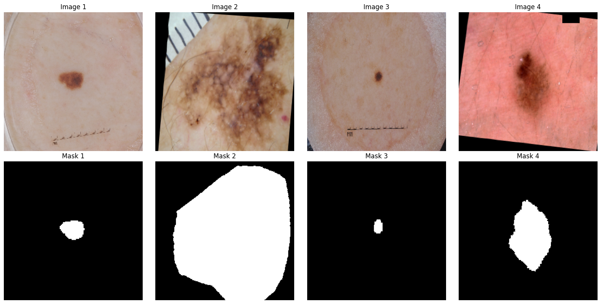
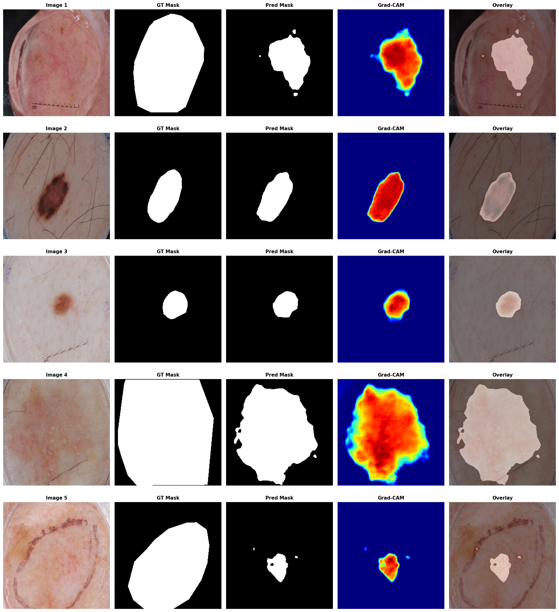

# ISIC 2017 Segmentation with JIT-Compiled Augmentation

In this tutorial, we are going to cover:

- Load the **ISIC 2017** dataset, a binary 2D segmentation dataset.
- Will use `jax` backend.
- Build a data loader using the **PyGrain** API.
- Build the **JIT** Transform Pipeline
- Build `AttentionUNet` model.
- Compute **GradCAM** visualizations.

```{note}
This example uses Tesla T4 GPUs available in the Kaggle environment. You can also run this code example directly on Kaggle; [gpu-notebook](https://www.kaggle.com/code/ipythonx/isic-segmentation-with-jit-compiled-augmentation).

```

**Setup**

```bash
!pip install grain -qU
!pip install keras -qU
!pip install git+https://github.com/innat/medic-ai.git -qU
```

## Imports and Configuration

Set the `jax` backend before importing Keras. The configuration block also
loads the libraries used for image decoding, visualization, PyGrain input handling,
and binary segmentation.

```python
import os
os.environ["KERAS_BACKEND"] = "jax"

from pathlib import Path

import cv2
import numpy as np
from matplotlib import pyplot as plt

import keras
from keras import ops
import grain.python as pygrain

from medicai.losses import BinaryDiceCELoss
from medicai.metrics import BinaryDiceMetric
from medicai.models import AttentionUNet
from medicai.transforms import (
    Compose,
    RandomAffine,
    RandomCutOut,
    RandomElasticTransform,
    RandomFlip,
)

if keras.config.backend() != "jax":
    raise RuntimeError("Start a fresh kernel with KERAS_BACKEND=jax.")
```
```python
input_shape = 256
batch_size = 24

# Enable mixed precision. Note: change `mixed_float16 to mixed_bfloat16 for TPU.
keras.mixed_precision.set_global_policy("mixed_float16")

# reproducibility
keras.utils.set_random_seed(101)

print(
    f"keras backend: {keras.config.backend()}\n"
    f"keras version: {keras.version()}\n"
)
```

## Locate the Dataset

The following paths match the Kaggle ISIC 2017 dataset layout. The code builds
separate records for training and validation, pairing each image with its
same-named segmentation mask and failing early when a mask is missing.

```python
data_dir = Path("/kaggle/input/datasets/ipythonx/isic-2017-challenge-datasets")

train_img_dir = data_dir / "ISIC-2017_Training_Data" / "ISIC-2017_Training_Data"
train_mask_dir = (
    data_dir
    / "ISIC-2017_Training_Part1_GroundTruth"
    / "ISIC-2017_Training_Part1_GroundTruth"
)

train_records = []
for image_path in sorted(train_img_dir.glob("*.jpg")):
    image_id = image_path.stem
    mask_path = train_mask_dir / f"{image_id}_segmentation.png"
    if not mask_path.exists():
        raise FileNotFoundError(f"Mask not found for {image_path.name}: {mask_path}")
    train_records.append({"image": image_path, "label": mask_path})

val_img_dir = data_dir / "ISIC-2017_Validation_Data" / "ISIC-2017_Validation_Data"
val_mask_dir = (
    data_dir
    / "ISIC-2017_Validation_Part1_GroundTruth"
    / "ISIC-2017_Validation_Part1_GroundTruth"
)

val_records = []
for image_path in sorted(val_img_dir.glob("*.jpg")):
    image_id = image_path.stem
    mask_path = val_mask_dir / f"{image_id}_segmentation.png"
    if not mask_path.exists():
        raise FileNotFoundError(f"Mask not found for {image_path.name}: {mask_path}")
    val_records.append({"image": image_path, "label": mask_path})

print(f"Training samples: {len(train_records)}")
print(f"Validation samples: {len(val_records)}")
```

## Define the PyGrain Source

The PyGrain data source exposes the file records through random access. It returns
paths only; decoding, resizing, normalization, and augmentation are kept in later
pipeline stages so each responsibility remains easy to inspect.

```python
class ISICDataset(pygrain.RandomAccessDataSource):
    def __init__(self, records):
        self.records = records

    def __len__(self):
        return len(self.records)

    def __getitem__(self, index):
        return self.records[index]
```

## Load Images and Masks

Images are converted from OpenCV's BGR ordering to RGB and scaled to `[0, 1]`.
Masks use nearest-neighbor resizing so class values are preserved, then become
single-channel binary floating-point arrays.

```python
def load_image(sample):
    image = cv2.imread(str(sample["image"]), cv2.IMREAD_COLOR)
    label = cv2.imread(str(sample["label"]), cv2.IMREAD_GRAYSCALE)
    if image is None or label is None:
        raise FileNotFoundError(f"Could not read image or mask for {sample}")

    image = cv2.cvtColor(image, cv2.COLOR_BGR2RGB)
    image = cv2.resize(
        image,
        (input_shape, input_shape),
        interpolation=cv2.INTER_LINEAR,
    ).astype(np.float32) / 255.0

    label = cv2.resize(
        label,
        (input_shape, input_shape),
        interpolation=cv2.INTER_NEAREST,
    )
    label = (label > 0).astype(np.float32)[..., None]
    return (image, label)
```

## Build the JIT Transform Pipeline

The pipeline applies geometric and masking augmentations after batching. Persistent
`SeedGenerator` instances allow JAX to trace the random operations while producing
new parameters on successive calls. Image data uses bilinear interpolation, while
the binary mask uses nearest-neighbor interpolation to preserve its labels.

```python
train_transform = Compose(
    [
        RandomFlip(
            keys=["image", "label"],
            spatial_axis=[1, 2],
            prob=0.5,
            input_layout="BHWC",
            seed=keras.random.SeedGenerator(11),
        ),
        RandomAffine(
            keys=["image", "label"],
            rotation_factor=0.15,
            scale_factor=0.1,
            translation_factor=0.07,
            shear_factor=0.03,
            interpolation={"image": "bilinear", "label": "nearest"},
            fill_mode="constant",
            fill_value={"image": 0.0, "label": 0.0},
            prob=0.5,
            input_layout="BHWC",
            seed=keras.random.SeedGenerator(13),
        ),
        RandomElasticTransform(
            keys=["image", "label"],
            alpha=(1.0, 3.0),
            sigma=4.0,
            interpolation={"image": "bilinear", "label": "nearest"},
            control_grid_spacing=(16, 16),
            locked_borders=1,
            fill_mode="constant",
            fill_value=0.0,
            prob=0.35,
            input_layout="BHWC",
            seed=keras.random.SeedGenerator(15),
        ),
        RandomCutOut(
            keys=["image"],
            mask_size=(32, 32),
            num_cuts=1,
            fill_mode="constant",
            fill_value=0.0,
            prob=0.25,
            input_layout="BHWC",
            seed=keras.random.SeedGenerator(17),
        ),
    ],
    jit_compile=True,
)
```

## Warm Up the Compiled Pipeline

Warmup triggers compilation before PyGrain iteration begins. The warmup tensors
therefore use the same batch-level rank, shape, dtype, and device placement as the
training batches.

```python
with keras.device("cpu:0"):
    train_transform.warmup(
        {
            "image": ops.ones(
                (batch_size, input_shape, input_shape, 3), dtype="float32"
            ),
            "label": ops.ones(
                (batch_size, input_shape, input_shape, 1), dtype="float32"
            ),
        }
    )
```

## Build the Datasets

Both datasets decode and batch samples in the same way. Random augmentation is
added only to the training dataset, while validation samples are decoded and
resized without random transformations. Batching occurs before augmentation so
the compiled transform receives `BHWC` tensors.

```python
def apply_augmentation(image, label):
    data = {"image": image, "label": label}
    with keras.device("cpu:0"):
        result = train_transform(data)
    return result["image"], result["label"]


def build_dataset(records, augment=False, shuffle=False):
    dataset = pygrain.MapDataset.source(ISICDataset(records))
    if shuffle:
        dataset = dataset.shuffle(seed=42)

    dataset = dataset.map(load_image)
    dataset = dataset.batch(
        batch_size,
        drop_remainder=shuffle,
    )
    if augment:
        dataset = dataset.map(lambda sample: apply_augmentation(*sample))

    return dataset.to_iter_dataset(
        read_options=pygrain.ReadOptions(num_threads=4),
    )

train_loader = build_dataset(
    train_records, augment=True, shuffle=True
)
val_loader = build_dataset(val_records)
```

The sanity check confirms that PyGrain returns the expected batch shapes and
that the image-mask pairs can be visualized before training.

**Sanity Check**

```python
# Example iteration
images, masks = next(iter(train_loader))
images, masks = (
    ops.convert_to_numpy(images), 
    ops.convert_to_numpy(masks)
)
print(images.shape, masks.shape)
# (24, 256, 256, 3) (24, 256, 256, 1)
```
```python
n = min(4, len(images))
fig, axes = plt.subplots(2, n, figsize=(4 * n, 8))

for i in range(n):
    ax1 = axes[0, i]
    ax1.imshow(images[i])
    ax1.set_title(f"Image {i+1}")
    ax1.axis("off")

    ax2 = axes[1, i]
    ax2.imshow(masks[i], cmap="gray")
    ax2.set_title(f"Mask {i+1}")
    ax2.axis("off")

plt.tight_layout()
plt.show()
```



## Build and Train the Model

This example uses `AttentionUNet` with an `EfficientNet-B0` encoder backbone. It
provides a practical 2D medical segmentation baseline that is expressive enough
for lesion localization while remaining straightforward to train and inspect. The
binary Dice-CE loss and Dice metric match the single-channel mask representation.

```python
model = AttentionUNet(
    encoder_name="efficientnet_b0",
    input_shape=(input_shape, input_shape, 3),
    num_classes=1,
    classifier_activation="sigmoid",
)

model.compile(
    optimizer=keras.optimizers.AdamW(
        learning_rate=1e-4,
        weight_decay=1e-5,
    ),
    loss=BinaryDiceCELoss(
        from_logits=False, num_classes=1
    ),
    metrics=[BinaryDiceMetric(
        from_logits=False, num_classes=1
    )],
    jit_compile=True,
)
```

## Callback

The checkpoint callback keeps the weights from the epoch with the lowest validation
loss, allowing the final evaluation to use the best validation checkpoint rather
than necessarily the last epoch.

```python
model_checkpoint_callback = keras.callbacks.ModelCheckpoint(
    filepath='isic.weights.h5',
    save_weights_only=True,
    monitor='val_loss',
    mode='min',
    save_best_only=True
)
```

## Training

The model is trained on the augmented PyGrain stream and evaluated on the
unaugmented validation stream. Model-side JIT compilation and dataloader-side
transform compilation are separate compilation boundaries.

```python
model.fit(
    train_loader,
    epochs=20,
    validation_data=val_loader,
)
```

## Evaluation

After training, a dedicated test loader evaluates the best saved model on unseen
ISIC test images. The reported loss and Dice score provide a final summary of
segmentation quality on held-out data.

```python
test_img_dir = data_dir / "ISIC-2017_Test_v2_Data" / "ISIC-2017_Test_v2_Data"
test_mask_dir = (
    data_dir
    / "ISIC-2017_Test_v2_Part1_GroundTruth"
    / "ISIC-2017_Test_v2_Part1_GroundTruth"
)

test_records = []
for image_path in sorted(test_img_dir.glob("*.jpg")):
    image_id = image_path.stem
    mask_path = test_mask_dir / f"{image_id}_segmentation.png"
    if not mask_path.exists():
        raise FileNotFoundError(f"Mask not found for {image_path.name}: {mask_path}")
    test_records.append({"image": image_path, "label": mask_path})

print(f"Testing samples: {len(test_records)}")
```
```python
test_loader = build_dataset(test_records)
```
```python
model.load_weights('isic.weights.h5')
```
```python
model.evaluate(test_loader)
```
```bash
25/25 ━━━━━━━━━━━━━━━━━━━━ 73s 3s/step - binary_dice_score: 0.7441 - loss: 0.6123
[0.6123020052909851, 0.7440601587295532]
```

## Visualization

The visualization compares the input image, ground-truth mask, predicted mask,
Grad-CAM heatmap, and prediction overlay for a small test batch. This makes it
easier to inspect both segmentation quality and the spatial regions emphasized by
the model.

```python
def plot_gradcam_results(model, grad_cam, test_ds, n=4):
    x, y = next(iter(test_ds))
    x, y = (
        ops.convert_to_numpy(x), 
        ops.convert_to_numpy(y)
    )

    # Model prediction
    y_pred = model.predict(x, verbose=0)
    y_pred = (y_pred > 0.5).astype(int)

    # Grad-CAM computation
    heatmaps = grad_cam.compute_heatmap(input_tensor=x)

    # Visualization setup
    n = min(n, len(x))
    fig, axes = plt.subplots(n, 5, figsize=(18, 4 * n))

    if n == 1:
        axes = np.expand_dims(axes, 0)

    for i in range(n):
        img = x[i]
        gt_mask = np.squeeze(y[i])
        pred_mask = np.squeeze(y_pred[i])
        heatmap = np.squeeze(heatmaps[i])

        # Normalize image for display
        img = np.clip(img, 0, 1) if img.max() <= 1 else img.astype(np.uint8)

        # Original Image
        ax1 = axes[i, 0]
        ax1.imshow(img)
        ax1.set_title(f"Image {i+1}", fontsize=11, weight='bold')
        ax1.axis("off")

        # Ground Truth Mask
        ax2 = axes[i, 1]
        ax2.imshow(gt_mask, cmap="gray")
        ax2.set_title("GT Mask", fontsize=11, weight='bold')
        ax2.axis("off")

        # Predicted Mask
        ax3 = axes[i, 2]
        ax3.imshow(pred_mask, cmap="gray")
        ax3.set_title("Pred Mask", fontsize=11, weight='bold')
        ax3.axis("off")

        # Grad-CAM
        ax4 = axes[i, 3]
        ax4.imshow(heatmap, cmap="jet")
        ax4.set_title("Grad-CAM", fontsize=11, weight='bold')
        ax4.axis("off")

        # Overlay
        ax5 = axes[i, 4]
        ax5.imshow(img)
        ax5.imshow(pred_mask, cmap="hot", alpha=0.4)
        ax5.set_title("Overlay", fontsize=11, weight='bold')
        ax5.axis("off")

    plt.tight_layout()
    plt.show()
```

```python
grad_cam = GradCAM(
    model,
    target_layer="decoder_stage1_conv_1_activation",
    task_type='auto'
)
```
```python
plot_gradcam_results(
    model, grad_cam, test_loader, n=5
)
```

