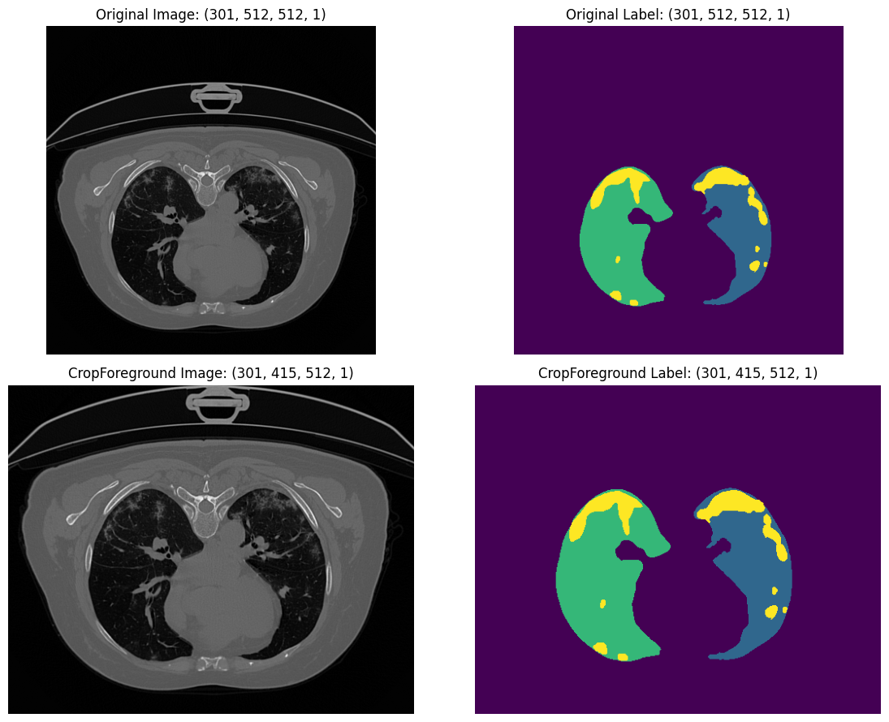
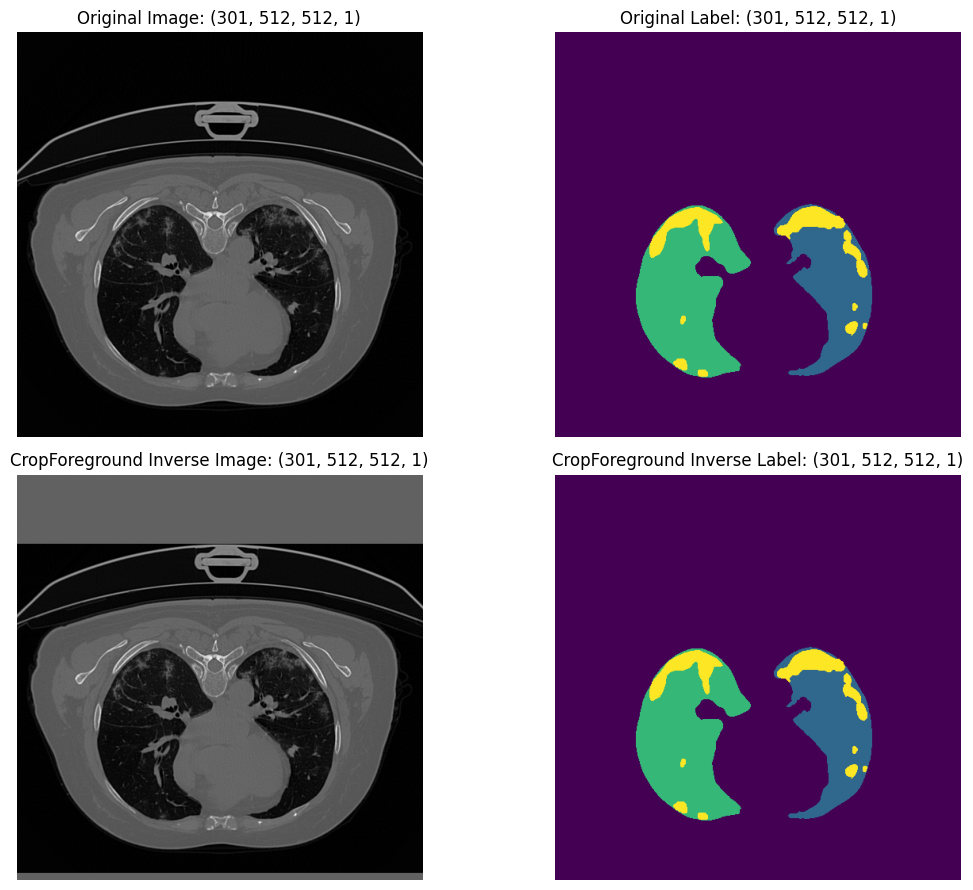
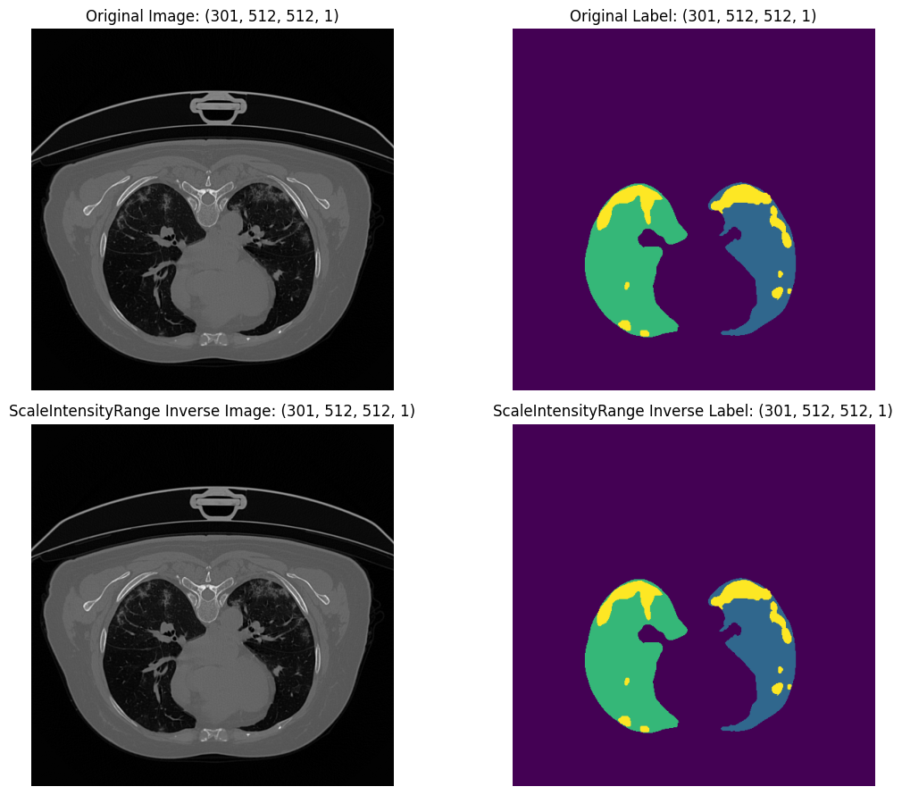
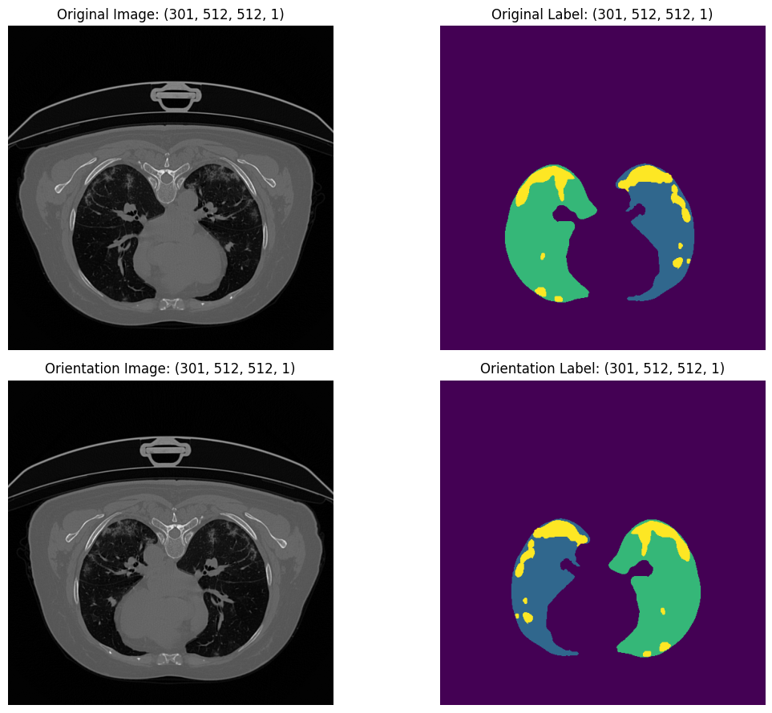
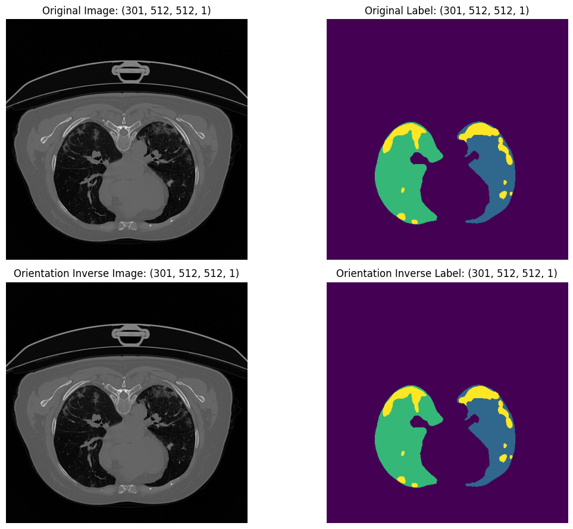
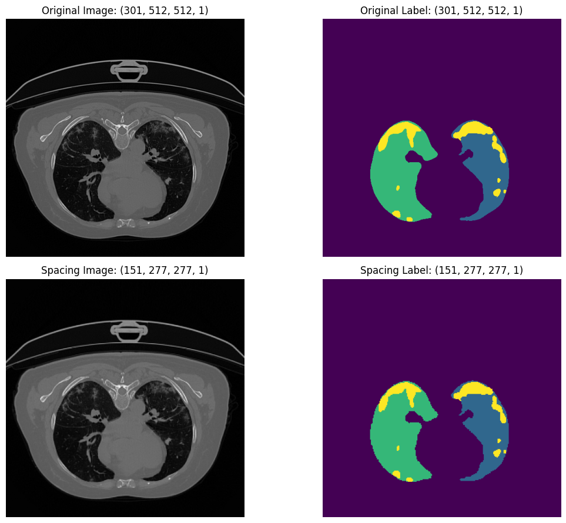
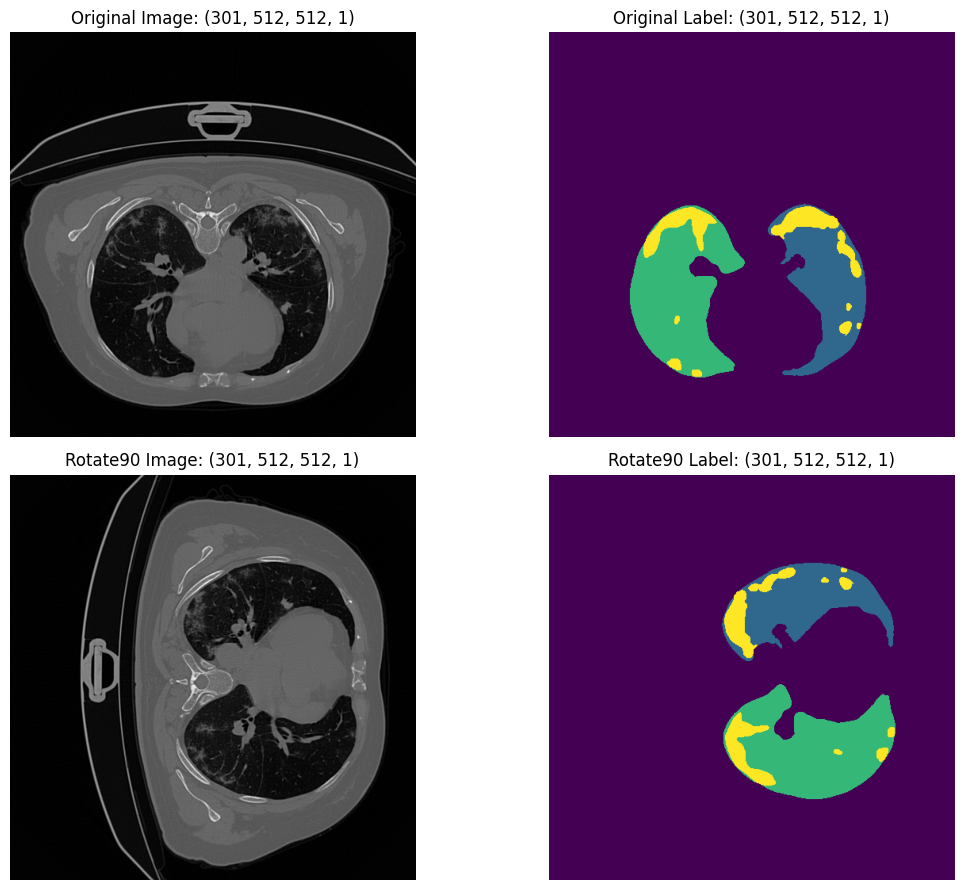
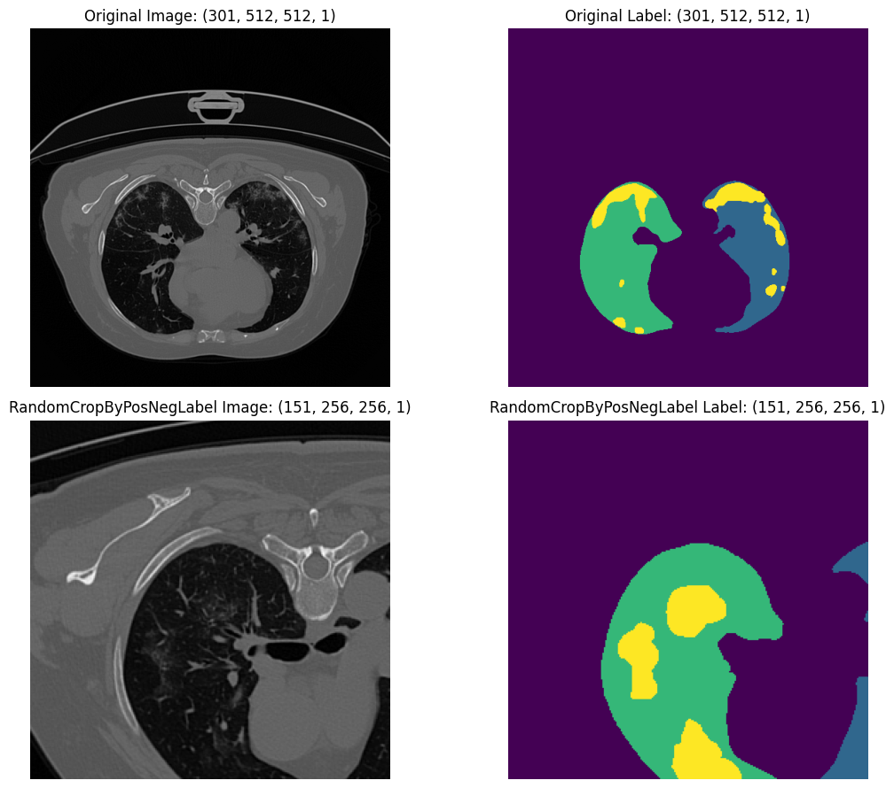

# Introduction

In this code example we will walk through COVID-19 dataset with ``medicai.transformation`` API. The dataset https://zenodo.org/records/3757476. It is a COVID-19 CT Lung and Infection Segmentation Dataset. 

The goal of this example is not only to show what each transform does visually,
but also to highlight an important design principle in ``medicai``:

- deterministic transforms can often be inverted
- inverse support is especially useful when predictions must be mapped back to
  the original image space
- the same transform objects can be used both interactively and inside data
  loaders

Throughout the walkthrough, we will inspect one image-label pair, apply a
single transform, and then call ``inverse()`` when the transform supports it.
This makes it easier to understand which transforms change geometry, which
transforms only change intensities, and what "restoring" means in practice.

```python
import os
import numpy as np
import nibabel as nib
from matplotlib import pyplot as plt

import medicai
from medicai.transforms import (
    Compose,
    CropForeground,
    Orientation,
    ScaleIntensityRange,
    Spacing,
    Rotate90,
    RandomCropByPosNegLabel,
    RandomCutOut
)
```

```python
image_path = 'data/images/coronacases_001.nii.gz'
mask_path = 'data/masks/coronacases_001.nii.gz'
```

```python
def py_load_image(image_path, label_path):
    image_nii = nib.load(image_path)
    label_nii = nib.load(label_path)

    image = image_nii.get_fdata().astype(np.float32)
    label = label_nii.get_fdata().astype(np.float32)
    affine = np.array(image_nii.affine, dtype=np.float32)

    # Reorder from file-native from depth last to depth first.
    image = np.transpose(image, (2, 1, 0))
    label = np.transpose(label, (2, 1, 0))
    affine[:, :3] = affine[:, [2, 1, 0]]

    if image.ndim == 3:
        image = image[..., np.newaxis]
    if label.ndim == 3:
        label = label[..., np.newaxis]

    data = {
        "image": image,
        "label": label,
    }
    meta = {
        "affine": affine,
    }
    return data, meta
```

The plotting helper displays a middle axial slice from the 3D volume. The top
row always shows the first sample and the bottom row shows the transformed or
restored sample. This makes it easier to compare image geometry and label
alignment side by side.

```python
def extract_mid_slices(sample):
    image = np.asarray(sample["image"])
    label = np.asarray(sample["label"])
    slice_index = image.shape[0] // 2
    image_slice = image[slice_index, ..., 0]
    label_slice = label[slice_index, ..., 0]
    return image_slice, label_slice


def create_plot(sample1, sample2, title1="Original", title2="Compared"):
    image1, label1 = extract_mid_slices(sample1)
    image2, label2 = extract_mid_slices(sample2)

    fig, [[ax1, ax2], [ax3, ax4]] = plt.subplots(2, 2, figsize=(12, 9))

    ax1.imshow(image1, cmap="gray")
    ax1.set_title(f"{title1} Image: {sample1['image'].shape}")
    ax1.axis("off")

    ax2.imshow(label1, cmap="viridis")
    ax2.set_title(f"{title1} Label: {sample1['label'].shape}")
    ax2.axis("off")

    ax3.imshow(image2, cmap="gray")
    ax3.set_title(f"{title2} Image: {sample2['image'].shape}")
    ax3.axis("off")

    ax4.imshow(label2, cmap="viridis")
    ax4.set_title(f"{title2} Label: {sample2['label'].shape}")
    ax4.axis("off")

    plt.tight_layout()
    plt.show()
```

```python
data, meta = py_load_image(
    image_path=image_path,
    label_path=mask_path,
)
```

## Crop Foreground

``CropForeground`` detects the non-background region from a source tensor and
applies the same crop to every requested key. This is often the first spatial
preprocessing step in medical segmentation pipelines because it removes large
empty margins and reduces memory usage for later transforms.

```python
crop_transform = CropForeground(
    keys=["image", "label"],
    source_key="image",
)

cropped = crop_transform(data, meta)
create_plot(data, cropped, title1="Original", title2="CropForeground")
```


Here the image and label are cropped together using the image foreground as the
reference. This keeps both tensors spatially aligned after the crop.

```python
restored_crop = crop_transform.inverse(cropped)
create_plot(
    data, restored_crop, title1="Original", title2="CropForeground Inverse"
)
```


The inverse of ``CropForeground`` is a placement inverse. It restores the
original canvas size and places the cropped content back into that space. It
does not reconstruct discarded background content beyond that placement.

## ScaleIntensityRange

``ScaleIntensityRange`` is useful when the modality has a known or chosen input
range. In CT workflows, it is common to clip or scale intensities from a
selected HU window into a compact range such as ``[0, 1]``.

```python
scale_transform = ScaleIntensityRange(
    keys=["image"],
    input_min=-1021.0,
    input_max=2996.0,
    output_min=0.0,
    output_max=1.0,
    clip=False,
)

scaled = scale_transform(data)
print(scaled['image'].numpy().min(), scaled['image'].numpy().max())
create_plot(data, scaled, title1="Original", title2="ScaleIntensityRange")
```


In this example the image intensities are mapped from the chosen CT range into
``[0, 1]`` while the label tensor is left unchanged.

```python
restored_scale = scale_transform.inverse(scaled)
print(restored_scale['image'].numpy().min(), restored_scale['image'].numpy().max())
create_plot(
    data, restored_scale, title1="Original", title2="ScaleIntensityRange Inverse"
)
```


Because ``clip=False`` here, the range mapping remains affine and can be
inverted exactly. If clipping were enabled, values outside the target interval
would be collapsed and exact inversion would no longer be possible.

## Orientation

``Orientation`` reorders and flips the spatial axes so the tensor matches a
requested anatomical orientation. This is particularly important when training
across data from different sources or scanners, where file-native axis order
can vary.

```python
orientation_transform = Orientation(
    keys=["image", "label"],
    axcodes="RAS",
)
oriented = orientation_transform(data, meta)
create_plot(data, oriented, title1="Original", title2="Orientation")
```


The image and label are both reoriented using the affine metadata. This keeps
the tensor layout and the physical orientation metadata consistent.

```python
restored_orientation = orientation_transform.inverse(oriented)
create_plot(
    data, restored_orientation, title1="Original", title2="Orientation Inverse"
)
```


The inverse restores both the original tensor layout and the original affine.

## Spacing

``Spacing`` resamples the volume into a target physical voxel spacing. This is
one of the most important medical-imaging transforms because different studies
often have different slice thickness and in-plane resolution.

```python
spacing_transform = Spacing(
    keys=["image", "label"],
    pixdim=(2.0, 1.5, 1.5),
    interpolation=("trilinear", "nearest"),
)
spaced = spacing_transform(data, meta)
create_plot(data, spaced, title1="Original", title2="Spacing")
```


Unlike simple shape-based resizing, ``Spacing`` uses the affine matrix to
interpret voxel spacing in physical space. The image uses trilinear
interpolation, while the label uses nearest-neighbor interpolation so class
boundaries are preserved.

```python
restored_spacing = spacing_transform.inverse(spaced)
create_plot(
    data, restored_spacing, title1="Original", title2="Spacing Inverse"
)
```


This inverse is also resampling-based: it restores the original spacing,
spatial shape, and affine metadata, but it should not be expected to reproduce
the exact original floating-point intensities voxel-for-voxel.

## Rotate90

``Rotate90`` is a deterministic geometric transform that rotates a tensor by
quarter turns in a chosen spatial plane. Because it is discrete and does not
require interpolation, it is a good example of an exactly invertible geometric
transform.

```python
rotate90_transform = Rotate90(
    keys=["image", "label"],
    k=1,
    spatial_axis=[1,2]
)
rotated = rotate90_transform(data, meta)
create_plot(data, rotated, title1="Original", title2="Rotate90")
```


```python
restored_rotated = rotate90_transform.inverse(rotated)
create_plot(
    data, restored_rotated, title1="Original", title2="Rotated 90 Inverse"
)
```


Here the inverse is exact because the operation is just a permutation and
reversal of axes.

## RandomCropByPosNegLabel

``RandomCropByPosNegLabel`` is meant for training-time sampling. Instead of
just taking any random patch, it biases the crop center toward positive or
negative label regions according to the configured ratio. This is useful when
the target structures occupy only a small fraction of the full volume.

```python
random_crop_transform = RandomCropByPosNegLabel(
    keys=["image", "label"],
    pos=2,
    neg=1,
    target_shape=[151,256, 256],
    image_reference_key='label',
    image_threshold=3 # 3 indicate covid sign in label.
)
rand_crop = random_crop_transform(data, meta)
create_plot(
    data, rand_crop, title1="Original", title2="RandomCropByPosNegLabel"
)
```


In this example, positive centers are sampled twice as often as negative
centers. The label tensor acts as the reference for selecting where the patch
should come from.


## Compose

After exploring single transforms individually, the final step is to combine
them into one preprocessing pipeline. ``Compose`` lets you package several
operations into a single callable that can be reused in notebooks, training
loops, validation code, or data-loader integrations.

```python
pipeline = Compose(
    [
        CropForeground(
            keys=["image", "label"],
            source_key="image",
        ),
        ScaleIntensityRange(
            keys=["image"],
            input_min=-1021.0,
            input_max=2996.0,
            output_min=0.0,
            output_max=1.0,
            clip=False,
        ),
        Orientation(
            keys=["image", "label"],
            axcodes="RAS",
        ),
        Spacing(
            keys=["image", "label"],
            pixdim=(2.0, 1.5, 1.5),
            interpolation=("trilinear", "nearest"),
        ),
    ]
)


def transformation(sample):
    data = {
        "image": sample["image"],
        "label": sample["label"],
    }
    meta = {
        "affine": sample["affine"],
    }
    result = pipeline(data, meta)
    return result["image"], result["label"]
```

The helper above shows the most common pattern:

1. unpack raw sample tensors into ``data``
2. place metadata such as ``affine`` into ``meta``
3. call the composed pipeline once
4. return the tensors needed by the model

```python
# Example with tf.data API
dataset = tf.data.Dataset.from_tensor_slices(...)
dataset = dataset.map(
    transformation, num_parallel_calls=tf.data.AUTOTUNE
)
dataset = dataset.batch(...)
```

When using ``tf.data``, the transformed outputs stay as TensorFlow tensors, so
they can flow directly into a Keras training step.

```python
# Example with keras.utils.PyDataset API
class MedicalPyDataset(keras.utils.PyDataset):
    ...

    def load_case(self, image_path, label_path):
        ...
        data = {}
        meta = {}
        data["image"] = image
        data["label"] = label
        meta["affine"] = affine
        return data, meta

    def __getitem__(self, index):
        ...
        images = []
        labels = []
        for sample_index in batch_indices:
            data, meta = self.load_case(
                self.image_paths[sample_index],
                self.label_paths[sample_index],
            )
            result = pipeline(data, meta)

            images.append(result["image"].numpy())
            labels.append(result["label"].numpy())

        return np.stack(images, axis=0), np.stack(labels, axis=0)
```

For ``keras.utils.PyDataset``, the transform results are still TensorFlow
tensors, but the dataset can convert them to NumPy arrays before stacking and
returning the batch.

```python
# Example with torch.utils.data.Dataset API
class MedicalTorchDataset(torch.utils.data.Dataset):
    ...

    def load_case(self, image_path, label_path):
        ...
        data = {}
        meta = {}
        data["image"] = image
        data["label"] = label
        meta["affine"] = affine
        return data, meta

    def __getitem__(self, index):
        data, meta = self.load_case(
            self.image_paths[index],
            self.label_paths[index],
        )
        result = pipeline(data, meta)

        image = result["image"].numpy()
        label = result["label"].numpy()

        # Optional: convert channel-last DHWC to channel-first CDHW for PyTorch.
        image = np.transpose(image, (3, 0, 1, 2))
        label = np.transpose(label, (3, 0, 1, 2))

        image = torch.from_numpy(image).float()
        label = torch.from_numpy(label).float()
        return image, label
```

For PyTorch-style datasets, the typical boundary is:

- `medicai` transform returns TensorFlow tensors
- convert those tensors to NumPy
- **optionally** reorder channel-last tensors to channel-first
- convert the final arrays to ``torch.Tensor``

This makes it possible to reuse the same ``medicai.transforms`` pipeline across
different training stack choices while keeping the transform logic in one
place.
