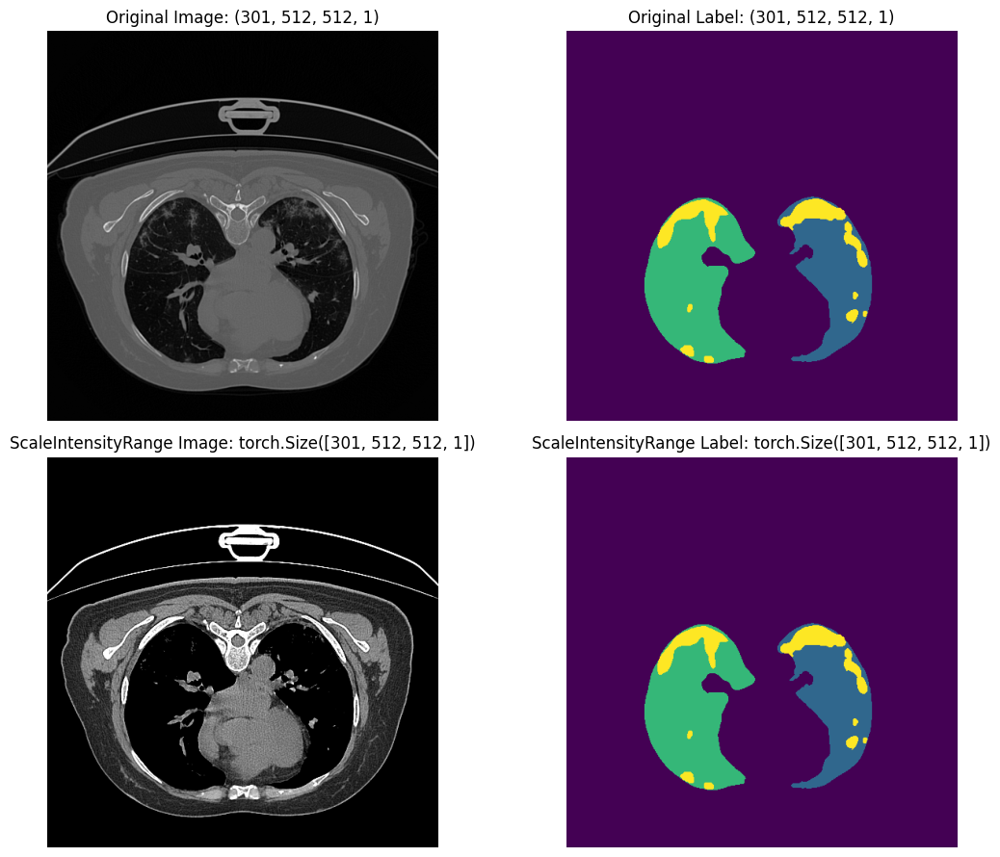
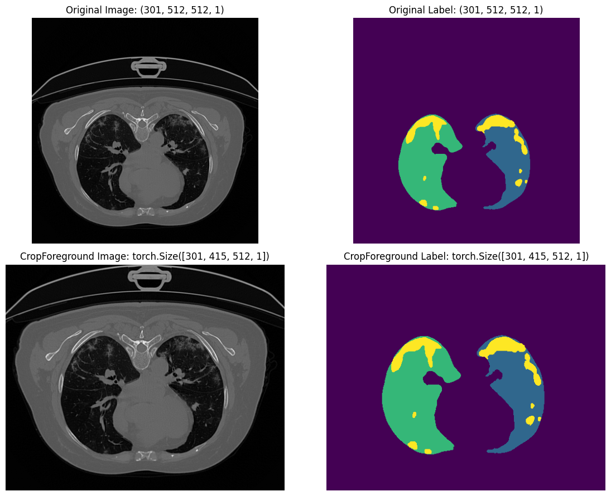
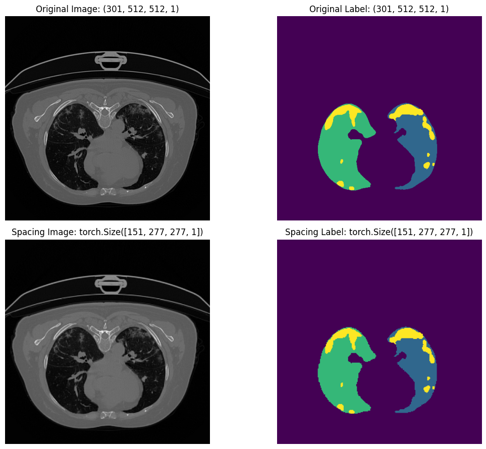
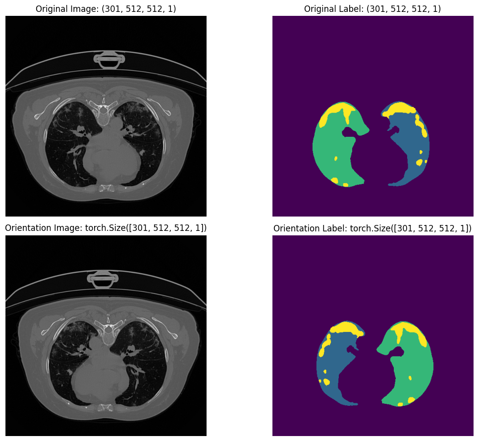
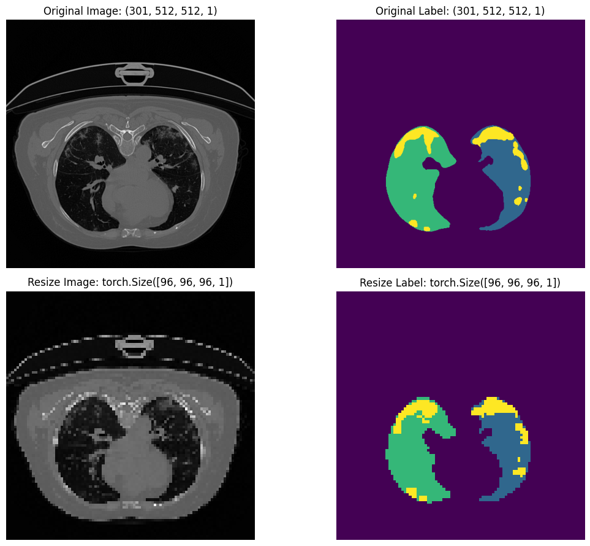
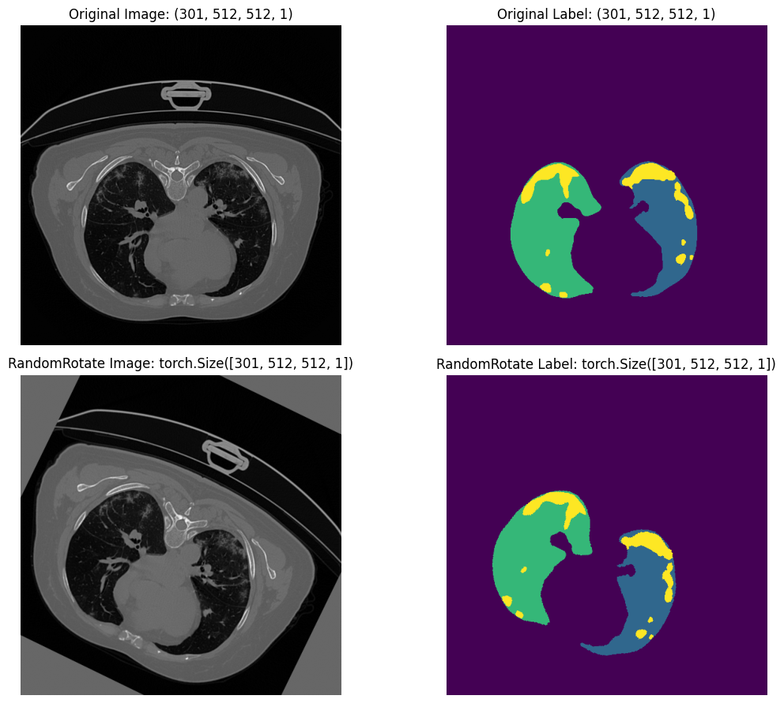
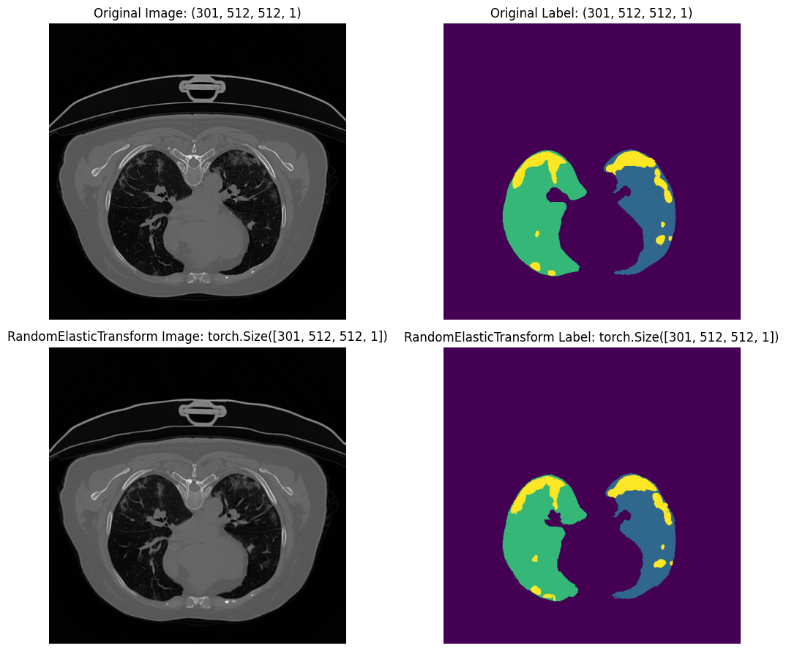
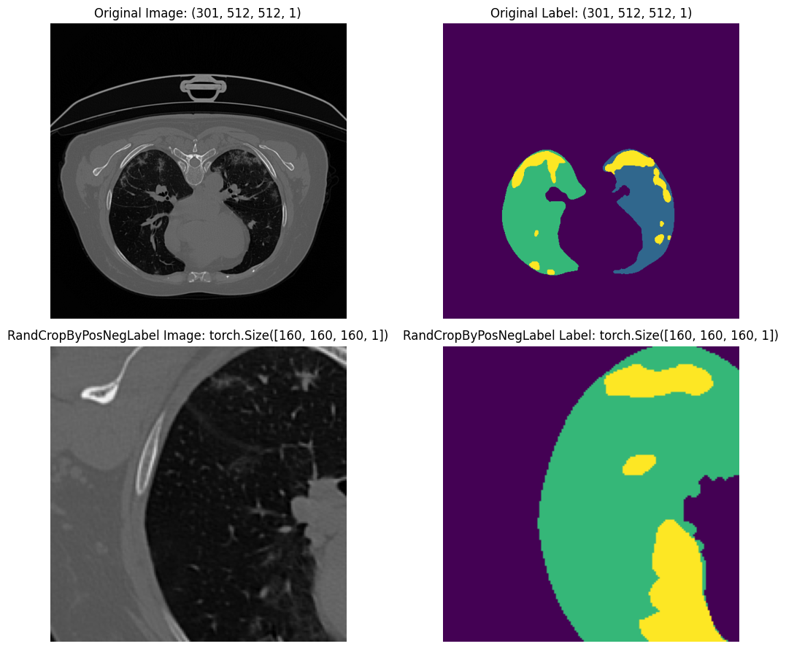
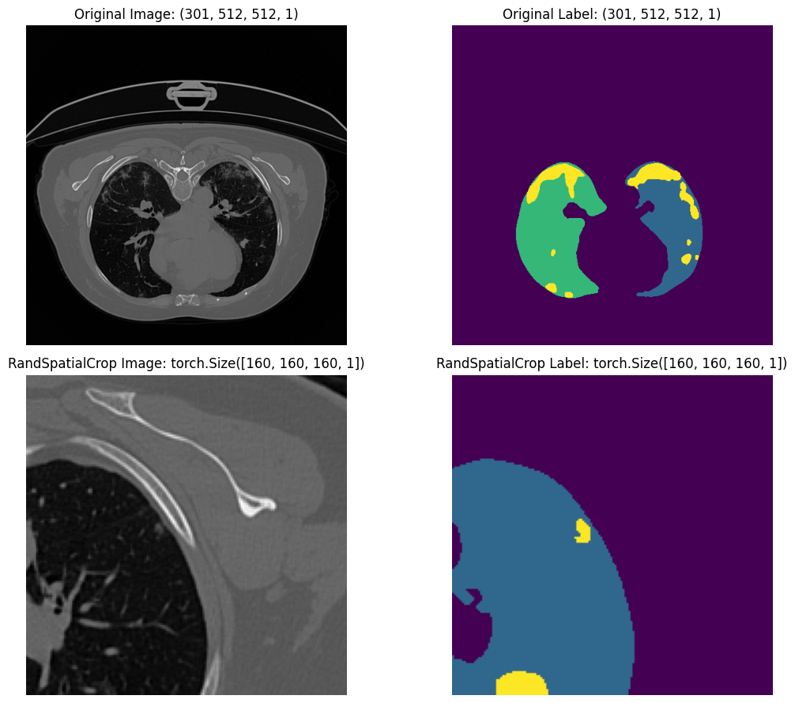
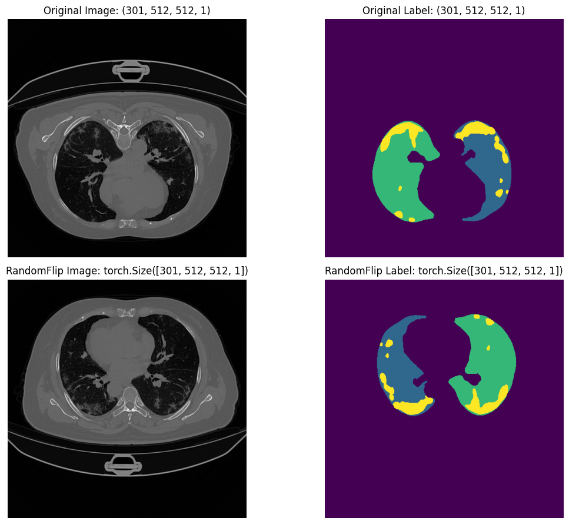

# Introduction

The goal of this example is to show what each transform does visually and to
highlight several important design principles in ``medicai``:

- image and label tensors can be transformed together while preserving their
  spatial alignment
- spatial metadata such as an ``affine`` matrix can be carried alongside the
  tensors
- the same transform objects can be used interactively and inside data loaders

Throughout the walkthrough, we inspect one image-label pair and apply some of the `medicai.transforms` API
transform independently. This makes it easier to understand which transforms
change geometry, which transforms only change intensities, and how image-label
alignment and spatial metadata are preserved.


```{note}
In this example, we walk through the COVID-19 CT Lung and Infection
Segmentation Dataset using the ``medicai.transforms`` API. The dataset is
available from [Zenodo](https://zenodo.org/records/3757476). You can also run
the example in the Kaggle [transformation notebook](https://www.kaggle.com/code/ipythonx/medicai-3d-medical-image-transformation).

```

```python
import numpy as np
import pandas as pd 
import os

import nibabel as nib
from matplotlib import pyplot as plt
```

```python
import os
os.environ["KERAS_BACKEND"] = "torch" # tensorflow, jax, torch - choose any!

import keras
from keras import ops

keras.version(), keras.config.backend()
```

```python
image_path = 'data/images/coronacases_001.nii.gz'
mask_path = 'data/masks/coronacases_001.nii.gz'
```
```bash
('3.15.1', 'torch')
```

## Utility

```python
def extract_mid_slices(sample):
    image = np.asarray(sample["image"])
    label = np.asarray(sample["label"])
    slice_index = image.shape[0] // 2
    image_slice = image[slice_index, ..., 0]
    label_slice = label[slice_index, ..., 0]
    return image_slice, label_slice


def create_plot(sample1, sample2, title1="Original", title2="Compared"):
    image1, label1 = extract_mid_slices(sample1)
    image2, label2 = extract_mid_slices(sample2)

    fig, [[ax1, ax2], [ax3, ax4]] = plt.subplots(2, 2, figsize=(12, 9))

    ax1.imshow(image1, cmap="gray")
    ax1.set_title(f"{title1} Image: {sample1['image'].shape}")
    ax1.axis("off")

    ax2.imshow(label1, cmap="viridis")
    ax2.set_title(f"{title1} Label: {sample1['label'].shape}")
    ax2.axis("off")

    ax3.imshow(image2, cmap="gray")
    ax3.set_title(f"{title2} Image: {sample2['image'].shape}")
    ax3.axis("off")

    ax4.imshow(label2, cmap="viridis")
    ax4.set_title(f"{title2} Label: {sample2['label'].shape}")
    ax4.axis("off")

    plt.tight_layout()
    plt.show()
```

## Data Loading

The loader below reads one image-mask pair from `NIfTI` files, converts the
arrays to the channel-last ``DHWC`` layout expected by the 3D transforms, and
stores the image affine in the sample metadata.

```python
def PyLoadImage(image_path, label_path):
    # load data
    image_nii = nib.load(image_path)
    label_nii = nib.load(label_path)
    image = image_nii.get_fdata().astype(np.float32)
    label = label_nii.get_fdata().astype(np.float32)
    affine = np.array(image_nii.affine, dtype=np.float32)

    # re-arrange shape [whd -> dhw]
    image = np.transpose(image, (2, 1, 0))
    label = np.transpose(label, (2, 1, 0))
    affine[:, :3] = affine[:, [2, 1, 0]]

    # add channel axis
    image = image[..., np.newaxis] if image.ndim == 3 else image
    label = label[..., np.newaxis] if label.ndim == 3 else label

    # pack to dict
    data = {}
    meta = {}
    data['image'] = image
    data['label'] = label
    meta['affine'] = affine
    return data, meta
```

## ScaleIntensityRange

``ScaleIntensityRange`` is useful when the modality has a known or chosen input
range. In CT workflows, it is common to clip or scale intensities from a
selected HU window into a compact range such as ``[0, 1]``.

```python
from medicai.transforms import ScaleIntensityRange

# define transformations
transform = ScaleIntensityRange(
    keys=["image"],
    input_layout='DHWC',
    source_value_range=(-175, 250),
    target_value_range=(0, 1),
    clip=True,
)
```
```python
# load the raw data
data, meta = PyLoadImage(image_path=image_path, label_path=mask_path)

for key, value in data.items():
    print(key, value.shape)
```
```python
# passing sample to medicai transform
output = transform(data)
```
```python
# plots
create_plot(data, output, title1="Original", title2="ScaleIntensityRange")
```



In this example the image intensities are mapped from the chosen CT range into
``[0, 1]`` while the label tensor is left unchanged.


## Crop Foreground

``CropForeground`` detects the non-background region from a source tensor and
applies the same crop to every requested key. This is often the first spatial
preprocessing step in medical segmentation pipelines because it removes large
empty margins and reduces memory usage for later transforms.

```python
from medicai.transforms import CropForeground

# define transformations
transform = CropForeground(
    keys=("image", "label"), 
    input_layout='DHWC',
    source_key="image"
)

# load the raw data
data, meta = PyLoadImage(image_path=image_path, label_path=mask_path)

# passing sample to medicai transform
output = transform(data, meta)

# plots
create_plot(data, output, title1="Original", title2="CropForeground")
```



## Spacing

``Spacing`` resamples the volume into a target physical voxel spacing. This is
one of the most important medical-imaging transforms because different studies
often have different slice thickness and in-plane resolution.

```python
from medicai.transforms import Spacing

# define transformations
transform = Spacing(
    keys=["image", "label"], 
    pixdim=[2.0, 1.5, 1.5],
    interpolation={
        "image":"trilinear", 
        "label":"nearest"
    }
)

# load the raw data
data, meta = PyLoadImage(image_path=image_path, label_path=mask_path)

# passing sample to medicai transform
output = transform(data, meta)

# plots
create_plot(data, output, title1="Original", title2="Spacing")
```


Unlike simple shape-based resizing, ``Spacing`` uses the affine matrix to
interpret voxel spacing in physical space. The image uses trilinear
interpolation, while the label uses nearest-neighbor interpolation so class
boundaries are preserved.


## Orientation

``Orientation`` reorders and flips the spatial axes so the tensor matches a
requested anatomical orientation. This is particularly important when training
across data from different sources or scanners, where file-native axis order
can vary.

```python
from medicai.transforms import Orientation

# define transformations
transform = Orientation(
    keys=["image", "label"], 
    axcodes="RAS"
)

# load the raw data
data, meta = PyLoadImage(image_path=image_path, label_path=mask_path)

# passing sample to medicai transform
output = transform(data, meta)

# plots
create_plot(data, output, title1="Original", title2="Orientation")
```


## Resize

``Resize`` changes the spatial dimensions of the volume to a requested target
shape. It applies **trilinear** interpolation to the image and **nearest-neighbor**
interpolation to the label, so continuous intensities are resampled smoothly
while discrete label values are preserved. The same spatial mapping is applied
to both tensors to maintain their alignment.

```python
from medicai.transforms import Resize

# define transformations
transform = Resize(
    keys=["image", "label"], 
    input_layout='DHWC',
    target_shape=(96, 96, 96),
    interpolation={
        "image": "trilinear",
        "label": "nearest",
    }
)


# load the raw data
data, meta = PyLoadImage(image_path=image_path, label_path=mask_path)

# passing sample to medicai transform
output = transform(data, meta)

# plots
create_plot(data, output, title1="Original", title2="Resize")
```

The output volume has the requested ``(96, 96, 96)`` spatial shape. Unlike
``Spacing``, this operation targets a tensor shape directly and does not use
the affine matrix to determine the physical voxel spacing.



## RandomRotate

``RandomRotate`` applies a randomly sampled continuous rotation to the image
and label. The image uses **bilinear** interpolation, while the label uses **nearest-neighbor** interpolation to avoid introducing fractional class values. The
rotation parameters are shared by both keys, keeping the image and label
spatially aligned.

```python
from medicai.transforms import RandomRotate

# define transformations
transform = RandomRotate(
    keys=["image", "label"], 
    input_layout='DHWC',
    factor=0.5, 
    interpolation={
        "image": "bilinear",
        "label": "nearest",
    },
)

# load the raw data
data, meta = PyLoadImage(image_path=image_path, label_path=mask_path)

# passing sample to medicai transform
output = transform(data, meta)

# plots
create_plot(data, output, title1="Original", title2="RandomRotate")
```


## RandomElasticTransform

``RandomElasticTransform`` applies a smooth, non-linear deformation field to
the volume. It is useful for simulating plausible anatomical variation during
training. The same field is applied to the image and label, with trilinear
interpolation for the image and nearest-neighbor interpolation for the label.
Here, the deformation field is resampled with a B-spline field interpolation
and generated on a coarse ``(16, 16, 16)`` control grid.

```python
from medicai.transforms import RandomElasticTransform

# define transformations
transform = RandomElasticTransform(
    keys=["image", "label"],
    input_layout="DHWC",
    alpha=6.0,
    sigma=10.0,
    control_grid_spacing=(16, 16, 16),
    interpolation={
        "image": "trilinear", 
        "label": "nearest"
    },
    field_interpolation="bspline",
    prob=1.,
)


# load the raw data
data, meta = PyLoadImage(image_path=image_path, label_path=mask_path)

# passing sample to medicai transform
output = transform(data)

# plots
create_plot(data, output, title1="Original", title2="RandomElasticTransform")
```



## RandomCropByPosNegLabel

``RandomCropByPosNegLabel`` is meant for training-time sampling. Instead of
just taking any random patch, it biases the crop center toward positive or
negative label regions according to the configured ratio. This is useful when
the target structures occupy only a small fraction of the full volume.

```python
from medicai.transforms import RandomCropByPosNegLabel

# define transformations
transform = RandomCropByPosNegLabel(
    keys=["image", "label"], 
    input_layout='DHWC',
    target_shape=(160,160,160), 
    pos=1, 
    neg=1, 
    num_samples=1,
    image_reference_key='label',
    image_threshold=3
)


# load the raw data
data, meta = PyLoadImage(image_path=image_path, label_path=mask_path)

# passing sample to medicai transform
output = transform(data)

# plots
create_plot(data, output, title1="Original", title2="RandCropByPosNegLabel")
```

In this example, positive and negative centers are sampled with equal weight.
The label tensor acts as the reference for selecting where the patch should
come from, and the ``image_threshold`` identifies the target region used for
positive sampling.



## RandomSpatialCrop

``RandomSpatialCrop`` extracts a fixed-size spatial patch from the volume. With
``random_center=True``, the crop center is sampled from the valid spatial
region, making this transform useful for training-time patch sampling. The
image and label are cropped with the same coordinates so their spatial
correspondence is preserved.

```python
from medicai.transforms import RandomSpatialCrop

# define transformations
transform = RandomSpatialCrop(
    keys=["image", "label"],
    input_layout="DHWC",
    crop_size=(160, 160, 160),
    random_center=True
)

# load the raw data
data, meta = PyLoadImage(image_path=image_path, label_path=mask_path)

# passing sample to medicai transform
output = transform(data, meta)

# plots
create_plot(data, output, title1="Original", title2="RandSpatialCrop")
```


## RandomFlip

``RandomFlip`` mirrors the volume along the selected spatial axes with the
configured probability. This example flips the height and width axes while
leaving the depth axis unchanged. Since the image and label use the same
sampled decision and axes, their spatial alignment is preserved.

```python
from medicai.transforms import RandomFlip

# define transformations
transform = RandomFlip(
    keys=["image", "label"],
    input_layout='DHWC',
    spatial_axis=[1,2], # H,W
    prob=1.0,
)

# load the raw data
data, meta = PyLoadImage(image_path=image_path, label_path=mask_path)

# passing sample to medicai transform
output = transform(data, meta)

# plots
create_plot(data, output, title1="Original", title2="RandomFlip")
```

